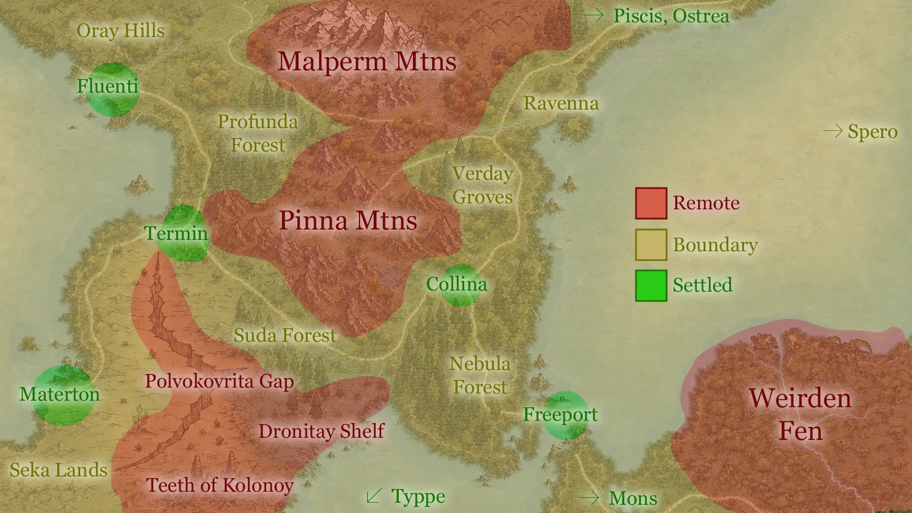

<figure>  <figcaption>The greater region, graded by how far the settled world reaches.</figcaption> </figure>

# Purpose

Thirty-seven location references in the format of the *Ironsworn* Atlas: a few paragraphs of place, a **Features** list you can pull sensory detail from mid-scene, and a **Quest Starter** to hang a session or a chapter on. Each entry is a separate note so it can be linked from prose, bestiary entries, and character docs.

The three countries have entries of their own ([[Nysis]], [[Mososi]] and [[Buralia]]) covering how each is governed, what pays for it, and what would break it. [[Regional]] holds the oracle table and the relations between them; city-scale material for Freeport lives in [[Freeport Gazetteer]]. Everything else here is the *land between*, and the places the roads only pass through.

## The Countries

|                 | Capital       | Governed by                                                 | Held together by                                                  |
| --------------- | ------------- | ----------------------------------------------------------- | ----------------------------------------------------------------- |
| **[[Nysis]]**   | none          | five *urbestroy*, answerable to nobody         | the Conclave's annual payment for [[Ravenna]], divided among them |
| **[[Mososi]]**  | [[Typpe]]     | a Directorate: the Direktor Roberto, through an unbribable inspectorate | food off [[Materton]]'s beds that no one can blockade             |
| **[[Buralia]]** | [[Altiplano]] | a travelling Emperor and the governors he leaves behind      | tribute, and an archive that forgets nothing                                |

---

# The Three Grades

The region is graded not by who claims it on a map but by how reliably the settled world reaches it.

| Grade | Meaning |
|---|---|
| **Settled** | Walls, a watch, an *urbestro* or equivalent, and a road that is maintained. Law is enforceable. Someone will come looking for you. |
| **Boundary** | Worked land (timber, charcoal, grazing, foraging) but no standing authority. Travelled in daylight and in company. Law is what your party can enforce. |
| **Remote** | Blight, high mountain, or country the Unmaking left broken. Entered deliberately, by people with a reason. Nobody is coming. |

The grade is a statement about **support**, not danger. Freeport will kill you as readily as the Weirden Fen. The difference is that in Freeport there is a body to bury.

---

---

# Settlement Scale

Lodestar's **Settlement: Type** oracle is rolled against the grade above, and it
tops out at Hold. Yrt's named settlements run past it, so the larger sizes are
not rolled: they are established places set on the map.

| Type | Population | Here |
|---|---|---|
| **Town** | 600–2,500 | [[Termin]], [[Sveba]], [[Vitre]], [[Collima]], [[Lokigi]] |
| **City** | 2,500–6,000 | [[Ostrea]], [[Piscis]], [[Fluenti]], [[Materton]], [[Mons]] |
| **Capital** | 6,000–10,000 | [[Typpe]], [[Altiplano]] |
| **Free port** | ~15,900 | [[Freeport]], which is its own case: bigger than everything and fed by ship |

The rolled tiers are Stead, Camp, Outpost, Hamlet, Village and Hold. Hold is
600–2,500, the same band as Town: the difference is that a Hold is rolled and a
Town is named. [[Alneta]] and [[Intersang]] are Villages, and are the only named
settlements small enough to sit on the rolled part of the table. Both are
landings rather than towns, which is why they carry a wharf, a bonded store and
a trade a place of that size has no other business supporting.

---

# Oracle: YRT Location

Roll 1d100.

| d100 | Result | Type |
| --- | --- | --- |
| 1–7 | [[Piscis]] | Settled |
| 8–14 | [[Ostrea]] | Settled |
| 15–21 | [[Collima]] | Settled |
| 22–28 | [[Freeport]] | Settled |
| 29–35 | [[Mons]] | Settled |
| 36–42 | [[Termin]] | Settled |
| 43–49 | [[Fluenti]] | Settled |
| 50–55 | [[Materton]] | Settled |
| 56–60 | [[Oray Hills]] | Boundary |
| 61–65 | [[Profunda Forest]] | Boundary |
| 66–70 | [[Verday Groves]] | Boundary |
| 71–75 | [[Nebula Forest]] | Boundary |
| 76–80 | [[Suda Forest]] | Boundary |
| 81–85 | [[Seka Lands]] | Boundary |
| 86–87 | [[Malperm Mtns]] | Remote |
| 88–89 | [[Pinna Mtns]] | Remote |
| 90–91 | [[Polvokovrita Gap]] | Remote |
| 92–93 | [[Dronitay Shelf]] | Remote |
| 94–95 | [[Teeth of Kolonoy]] | Remote |
| 96–97 | [[Weirden Fen]] | Remote |
| 98–99 | [[Ravenna]] | Remote |
| 100 | [[Spero]] | Remote |

## Off-oracle entries

Ten places have Atlas entries but no slot on the roll, because you do not
stumble into them: you go through a neighbour to get there. Roll the parent,
then decide. The last three are water rather than ground, and a party is on
them because it took a boat.

| Location | Type | Reached via |
| --- | --- | --- |
| [[Typpe]] | Settled | The Falter Bay crossing, or the road west out of [[Seka Lands]] |
| [[Sveba]] | Settled | Boat from [[Materton]] or [[Fluenti]] |
| [[Vulkana Caldera]] | Remote | The high road above [[Mons]] |
| [[Vitre]] | Settled | The strip east of [[Termin]], between the two customs posts |
| [[Lokigi]] | Settled | The Materton road south-west, or any barge on [[Falter Bay]] |
| [[Intersang]] | Boundary | The road down from [[Mons]], or a Mososi barge across the Bay |
| [[Falter Sound]] | Boundary | Any hull out of [[Freeport]], [[Piscis]] or [[Alneta]] |
| [[Falter Bay]] | Boundary | Freeport's canal, or down from [[Typpe]] |
| [[Sea of Bees]] | Remote | Past [[Piscis]], or out of [[Ostrea]] with the whalers |
| [[Beyond the Sea of Bees]] | Remote | A berth on a Biel, Ramage or Gelandian hull, and nobody local has the chart |

---

# Progress

- [x] Piscis
- [x] Ostrea
- [x] Collima
- [x] Freeport
- [x] Mons
- [x] Termin
- [x] Fluenti
- [x] Materton
- [x] Oray Hills
- [x] Profunda Forest
- [x] Verday Groves
- [x] Nebula Forest
- [x] Suda Forest
- [x] Seka Lands
- [x] Malperm Mtns
- [x] Pinna Mtns
- [x] Polvokovrita Gap
- [x] Dronitay Shelf
- [x] Teeth of Kolonoy
- [x] Weirden Fen
- [x] Ravenna
- [x] Spero
- [x] Typpe *(off-oracle)*
- [x] Sveba *(off-oracle)*
- [x] Vulkana Caldera *(off-oracle)*
- [x] Vitre *(off-oracle)*
- [x] Falter Sound *(off-oracle, water)*
- [x] Falter Bay *(off-oracle, water)*
- [x] Sea of Bees *(off-oracle, water)*
- [x] Beyond the Sea of Bees *(off-oracle: Biel, Ramage, Gelandia)*
- [x] Lokigi *(off-oracle)*
- [x] Intersang *(off-oracle)*
