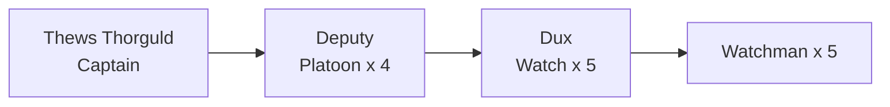

<figure>  <figcaption>Freeport sits at the nexus of three trading kingdoms.</figcaption> </figure>

## At a Glance

*City state · **Settled** · Free-trade port, triumvirate rule*

Freeport sits on a flat, swampy isthmus where the Kingdom of Nysis runs into the Buralian Empire, and it exists because of a single accident of water: a narrow tidal river between Falter Bay and Falter Sound, widened by the Unmade into a sixty-five-foot canal, and a harbour on the Sound deep enough for the big hulls out of the Sea of Bees. Almost nowhere else on this coast can take those ships. Everything else about Freeport follows from that.

Its neutrality is not a moral position, it is the product. Nysis and Mososi will not trade directly with each other on any terms either can accept — the tariff at [[Termin]] sees to that — so a great deal of what crosses Freeport's docks is Nysisian goods bound for Mososi and Mososi goods bound for Nysis, passing within a hundred yards of each other and paying Freeport for the privilege of not meeting at the border.

The city is neutral and says so constantly. It is ruled by three — the lord of merchants, the chief priest of the Pura Ecclesia, the archmage of the Conclave — and by a fourth nobody names aloud, the Brotherhood's shadow lord. Goods pass through untaxed if they are only passing; coin and valuables can be lodged here without account or question; the border wars of three countries are watched from the walls with professional interest and no opinion. The tide runs inland twice a day and out twice a day, and a tidal basin upstream is released every night to scour the canal, and the city has arranged its entire commercial life around that timetable.

It floods. The isthmus is low and the ground is wet and the Stews sits in a depression where houses stand on stilts and the muck comes and goes beneath them. The embankments have been raised ten feet and it is not enough. What Freeport offers is not comfort or safety — it is the only place in the region where a person with money and no history can become someone, and the only place where the three powers are obliged to be polite to each other in public.

**Features**
- The canal, and the chain that goes up at dusk
- Deep-water hulls at Dock Walk, lighters and barges everywhere else
- Blue Sashes running berthing chits at a dead sprint
- Customs clerks, day logs, and the smell of tallying
- The Stews on stilts, and what moves under them at low tide
- Caravanserai wagons camped outside the gates after dark
- Fog off the Sound that swallows the Upper Market whole
- Watch station teams at every gate, checking faces
- Conclave grey, Ecclesia bells, and Brotherhood silence, all in one street
- Water standing in the lanes for a week after a spring tide

**Quest Starter**
> Something lodged in a Freeport vault "without account and without question" has been claimed by two parties on the same morning, and both claims are in order. The house cannot honour either without making an enemy of a power it depends on. It would prefer the item simply be gone before the matter is decided. Who hired you first?

---

Population: 15,900
Economy: trading port
Status: Sovereign city state
Government: Triumvirate Oligarchy

The town of Freeport is a coastal town at the nexus of three trading kingdoms: Nysis, Mososi, and Buralia. A sovereign city state, it is ruled by a triumvate of leaders: the lord of merchants, chief priest of the Puritans, and archmage of the Conclave. A shadow lord, the chief of assassins, is the unacknowledged silent fourth in this power quadrangle, although the public only openly speaks of three. 

The city sustains itself as a free trade zone of goods from the surrounding lands, deems itself neutral in the invariable border struggles, and offers a haven for sheltering valuables and coin tax free and without account. It is one of the few ports that has a harbor deep enough to allow larger ships to berth from the distant ports across the Sea of Bees.
## Population

| Type                                                      | Notes                                                                                                                                           | Typical Annual Salary in Gents             | Count  |
| --------------------------------------------------------- | ----------------------------------------------------------------------------------------------------------------------------------------------- | ------------------------------------------ | ------ |
| Merchants, traders, brokers                               | These are Freeport’s lifeblood, running shops, market stalls, warehouses, and conducting business at the docks.                                 | 80–120                                     | 2,000  |
| Sailors, Dockworkers, Shipwrights                         | Critical for a trade nexus including both natives and itinerant maritime labor.                                                                 | 20–30 (sailors/docks), 30–60 (shipwrights) | 4,000  |
| Craftsmen and Artisans                                    | Tanners, blacksmiths, coopers, weavers, bakers, and other skilled trades                                                                        | 30–80                                      | 3,000  |
| Farmers, Fishers, and Food Vendors                        | Even in cities, many city dwellers are involved in food production or processing includes those traveling in from surrounding lands             | 20–40                                      | 2,000  |
| Guards, Soldiers, Watchmen, Runners                       | Needed for defense and order. Runners 50. Guards 150.                                                                                           | 30–40                                      | 200    |
| Mages, Healers                                            | Users of mana command high salaries because they use expensive materials                                                                        | 200-300                                    | 100    |
| Religious Figures, Healers, Scribes, Scholars, Bankers    | Priests, monks, and temple workers are common, as well as those tied to learning or administration                                              | 20–40                                      | 400    |
| The Poor, Beggars, Slum Dwellers                          | A large underclass, including orphans and those “touched” or marginalized                                                                       | 1–10                                       | 2,000  |
| Entertainment, Service, and Hospitality Workers           | Innkeepers, tavern folk, courtesans, musicians, actors                                                                                          | 20–50                                      | 1,400  |
| Criminal Underworld (Brotherhood, Smugglers, Pickpockets) | These are clustered in hidden parts of the city                                                                                                 | 10–100 (varies wildly)                     | 300    |
| Nobility/Wealthy Elites                                   | A tiny but influential segment—often controlling key guilds/offices.                                                                            | 300+                                       | 100    |
| Foreigners, Transients, and Outcasts                      | Freeport’s open policy and trade magnetism brings hundreds to thousands of outsiders at any time including temporary labor, mercenaries, exiles | varies (10–80 for most)                    | 2000   |
|                                                           |                                                                                                                                                 | **Total**                                  | 17 500 |
## Citizenship
In order to be a citizen you must either 
* Own property, be registered with the Grand Office, and pay taxes (1% of property value)
* Own a business, be registered with the Grand Office, an pay taxes (5% of net profits annually)
* Be born of two citizens
* Serve a full term of 20 years in the town guard or civil service with an honorable discharge
* Granted citizenship by the triumvirate for great deeds or largesse benefiting the city

Citizenship privileges:
* Right to a fair trial (otherwise a magistrate will simply decide your fate)
* Right to vote and hold office
* Right to marry another citizen (marrying a non-citizen means your children will not be citizens)
* Exemption on conscription but can enlist or purchase an officer's commission
* Immunity from certain punishments (whipping, torture, or public execution)
* Cannot be enslaved for payment of debt

Non-citizens can be residents but are typically renting or squatting. 
## Neighborhoods

### West March
Wealthiest merchants, administrators, and clergy reside here. Home to the Grand Office and the Conclave and the Pura Ecclessia. Visiting dignitaries and merchants are often housed in the Azure Court, just north east of the Grand Office.
### Riverside
A step down from West March but up and coming middle class reside here.
### South Wards
The South Wards is known for the Caravanserai, a holding grounds for overland caravans going to and from Falter Bay and Collima. Larger caravans will load and unload into local wagons using day laborers, and bring goods up Shywalk and Riverwalk to the Lower and Upper Market. Horse stalls, farriers, coopers and wheelwrights, blacksmiths, and cheap pubs and inns are in this area.
### Market
A vibrant and noisy scene: fish markets, trade goods, warehouses, longshoremen, ship supplies, 
### Shy Side
Mostly residential for those that work at the port and the canal. 

### Stews
As in many towns in the greater kingdoms, the touched are invariably shunted to the outskirts of the economy, often living hand to mouth with little to no possibility of advancement. In Freeport, many of the touched, down on their luck immigrants, beggars, and ne'er-do-wells find themselves a home in the Stews. Not protected by embankments, it often floods during the rain. Sanitation is poor, wells often fill with storm water and disease is ever present. Some of the better houses and inns have been built on stilts in order to stay dry. Guards rarely patrol here but there is a station at Stewing Cross and at Shywalk just before Shyside that residents can appeal to.
## Geography

The city sits at the middle of an isthmus joining the Kingdom of Nysis and and the Buralian Empire. A long natural canal connects Falter Bay and Falter Sound. The isthmus is flat and swampy which means that flooding in the city is a frequent occurrence. Some of the houses in the Stews, which sits in a depression, are on stilts, allowing the muck and wash but not the stink to pass the residents by. The sides of the canal, docks, and embankments have been artificially raised to 10 feet high, keeping the tide at bay.

Tides are approximately 6 hours apart.
- At **flood tide** (when Falter Sound’s tide rises), seawater **flows inland** through the canal toward Falter Bay.  
- At **ebb tide** (when the tide falls), water **flows outward** from the canal and estuary into the Sound.

| Time     | Tide Phase | Flow Direction            | Notes                                    |
| -------- | ---------- | ------------------------- | ---------------------------------------- |
| 6:00 AM  | Flood Tide | Falter Sound → Falter Bay | Incoming tide fills the bay from the sea |
| 12:00 PM | Ebb Tide   | Falter Bay → Falter Sound | Outgoing tide drains toward the sea      |
| 6:00 PM  | Flood Tide | Falter Sound → Falter Bay | Tidal basin filling begins               |
| 12:00 AM | Ebb Tide   | Falter Bay → Falter Sound | Tidal basin water released for scouring  |

A tidal basin (some 310 ft in diameter) sits near the south end of town to ensure that the canal and port remain silt-free. The gates are opened during the 6pm flood and released at the midnight ebb. The Harbormaster and his crew are responsible for maintaining the tidal basin.
## Heraldry
<figure>  <figcaption>Azure, a mermaid argent stantant facing sinister</figcaption> </figure>

The field of the shield is azure (light blue), symbolizing loyalty, truth, and the sea. The charge is a mermaid argent (rendered in silver or white), emblematic of Freeport’s maritime heritage, allure, and the city’s elusive, protective spirit.
## Town Guards

The town guards are under the day to day direction of the Grand Office but ultimately, the Captain of the Guard, Thews Thorguld, answers to the triumvarate. They have their barracks and armory north of the Grand Office. There are a total of company of 100 guards for the city divided into 4 platoons with 5 watch teams of 5 men. Each platoon is lead by a **deputy** (sergeant) and each watch team by a **dux** (corporal). Deputy Drumph is a bad gambler and can be influenced by the Brotherhood, who often purchases his debts, or for a hefty bribe.

Men and teams are rotated through 8 hour shifts, on and off.

A watch team consists of a 5 man team and a dux. They are armed with billy clubs, short swords,  as well as two crossbows and are identified by their bright blue tabards emblazoned with Freeport's symbol, the silver mermaid. They wear leather armour and studded leather caps. Patrolling watch teams cover the west and east embankments and also patrol along Riverwalk and Shywalk end-to-end. Additional watch teams are in the West March, River Side, South Wards, Market and Docks, Fey Docks, and Shy Side.

Watch teams patrol along a set route that changes daily as detailed by Captain Thews (he is not known for his creativity). The Stews are mostly unpatrolled, except for the crossing and along Shywalk. When in trouble, the team will blow whistles and in dire need, send up a manite flare that the dux carries on his belt. A general call to arms can be made by ringing the bell just outside the Grand Office and the shooting of a green flare that is kept in the Captain Thew's Office, the Fey Docks guard station, and the Harbor Customs office as well as a lockbox at Stewing Cross.

A station team consists of 2 men, similarly attired and armed except no crossbows. Station teams are at the Collima Gate, Grand Bridge, River Bridge, Falter Bay Gate, Mons Gate, Stewing Cross, and Shyside Station. They generally check people coming and going to see if they are allowed into the city. 14 men total. Manite flares are kept in the station houses for sounding the alarm.

Overland commerce of quantity is not unusual and caravans come into the city via the Falter Bay gate or the Mons gate. If the caravan is not local, guards can issue a customs chit to them, which require them to check in at the customs office to see if duty needs to be paid. A runner is sent with the caravan to ensure they make it to the customs office. After dark, no carts or wagons are allowed into or out of the city and they will need to make camp at the Caravanserai near the Mons gate or on the flats outside of the Falter Bay gate.

<figure>  <figcaption>The watch team at Collima gate.</figcaption> </figure>

Two man teams are stationed at each tower in the harbor along with a work crew to raise and lower the chains. The teams are given flag codes each day. The flag code indicates the tower and entry or exit time slot for a ship.

The Pura Ecclessia and Conclave along with other wealthy individuals have their own private guards.

### External Contracts

The Town Watch is not funded by city tax revenue alone. A substantial share of its operating budget — by some accountings the larger share — comes from **external contracts** hired by parties beyond the city itself. Captain Thews's office handles contracts under a certain weight; major contracts require Triumvirate ratification.

The standard clients:

- **The Conclave** maintains standing contracts for prisoner transit, refinement-site escort, Refiners' Guild inspector escorts on dangerous routes, and the protection of mana shipments. The bulk of Watch external revenue comes from Conclave contracts, which is why the loss of any of those would force layoffs.
- **The Pura Ecclesia** hires the Watch for missionary escort to outlying districts, doctrinal-enforcement detail in the Stews and Shy Side wards, and the protection of major religious processions on feast days.
- **The Brotherhood** hires the Watch for caravan escort on the Mons road and overland trade routes to the inland mining regions. The Brotherhood's contracts are formally legitimate and informally complicated — the cargo a Watch team is paid to escort is not always cargo the Watch should be escorting. Deputies like Drumph, who are corruptible, can be quietly assigned to the Brotherhood's more sensitive runs; deputies like Forthwith refuse such assignments and accept the lost income.
- **Wealthy private clients** hire the Watch for warehouse stakeouts, vault transits, household protection during high-risk periods, and similar discrete work.

Contract teams are pulled from the standard city patrol rotation. A team on contract is out of city duty for the contract's duration; backfill is managed by Captain Thews's office through cross-platoon coverage. The Watch's nominal size of 100 guards is therefore deceptive — at any given time, perhaps 70 to 80 are actually on city patrol, the rest on external contracts of varying duration.

A standard prisoner-transit contract — a disgraced Maester escorted down from one of the Ravenna sites, say — pulls one full watch team (5 watchmen and a dux) for the trip duration. Larger contracts (mana shipments, multi-team escorts) require multiple teams and command attention by the platoon's deputy. Captain Thews personally signs off on any contract involving more than two teams.

The corruption opportunities are obvious. A deputy whose debts have been purchased by the Brotherhood is unlikely to assign honest officers to a contract that requires looking the other way. The Watch's institutional health depends on the Triumvirate's continued willingness to fund corruption-resistant leadership; the Triumvirate's continued willingness depends on the Watch performing its city-patrol duties without scandal. The system functions because no party can quite afford to break it.

## Runners

Runners are used by the city to send communications around town. They are a trusted courier guild with high standards for their conduct. The guards, merchants, customs, and noble houses all use runners, night and day. A running squad is usually assigned an area of the city to service and customers have their favorite runners that they like to use. Runners are noted by the blue sashes they wrap around their waist. Interfering with a runner is serious business.

## The Canal
There is a 65 ft canal that was built upon a narrow tidal river that flows from Falter Bay to the Falter Sound. Upstream there is a tidal basin that is unleashed every night to scrub silt and sediment that builds up in the canal. 

The canal is typically 6 ft deep during low tide and 16 ft deep during the reverse tide. Barges typically ply the canal carrying trade goods back and forth. Normally barge traffic flows with the tides but the Harbormaster may order ropes and mules on Shywalk to pull barges upstream or downstream depending on volume until the barges are past the city limits and then need to use poles or oars.

Small barge (15–20 m long, light cargo):
* Loaded draft about 0.6–0.9 m (2–3 ft).
* Nearly half that when empty.
* Cargo capacity: roughly 20–40 tons.
* Feels right for local trade, village‑to‑town runs, or a single merchant family’s cargo.
* Typical crew size: Around 2–4 people.
	* Master/owner (navigates, keeps accounts, deals with cargo and tolls).
	* 1–2 barge hands (handle poles, lines, sometimes oars; walk towpaths if towing by hand or animal).
	* Possibly 1 extra youth or family member as general helper.
Larger river barge (20–25 m, heavy cargo):
* Loaded draft about 1.0–1.2 m (3–4 ft).
* Perhaps ~0.6 m (2 ft) when mostly empty.
* Cargo capacity: roughly 60–120 tons.
* Suits major trade routes, grain, timber, ore, or bulk cargo into a city like Freeport.
* Typical crew size: About 4–8 for bigger, sail‑rigged barges in the 60–120 ton range.
	* Master.
	* Mate (deputy navigator, supervises work).
	* 2–4 sailors/boatmen (sails, mooring, poling, towing, cargo handling).
## Bridge Access

Bridge access at the Stews, River Bridge, and Grand Bridge is generally open until the evening. At 8 pm guards are set to patrol the bridges, asking those that want to cross their business. It's generally lax and some guards can be persuaded with a monetary contribution to their retirement plan to let people pass unnoticed. The guards are alert to any smuggling that might happen, especially at Stewing Cross.

The Grand Bridge is made of stone and the showpiece of the town as it spans the canal in a single arch. It is the newest bridge in the city. The Stews and River Bridge are made of wood with a single pylon in the middle. 

## Trade and Customs

Freshwater traffic comes up from Falter Bay, during the day only, usually with the tide, as the reverse tide will push the waters in the opposite direction well past the city. A runner will issue a berthing chit at Stewing Cross and the chain men will lower chain under the bridge to allow passage. Runners between the inner harbor and the cross run new chits as needed. Runners are called Blue Sashes for the bright blue waist sashes that they wear to identify themselves.

Bay traffic will tie up at the west docks where they will undergo customs inspection. Upon docking, they turn over their berthing chit to the inspector. The inspector will get the manifest from the captain and perform the inspection. Lots of opportunity for corruption here, so the inspectors are assigned at random and frequently switched between the west, east, and fey docks. After the inspection has cleared, the manifest will be stamped with the inspector's stamp.

During the day, captains are responsible for turning manifests into the custom's office at Dock Walk, where a clerk enters the sheet information into the day log book and duties are calculated and paid by the captain on the spot in return for an exit chit (either to enter the Sea of Bees or go back into Falter Bay). The exit chit is turned over by the captain to the Harbormaster in exchange for a flag code. The ship or barge will use that flag signal to tell Stewing Cross or the designated See of Bees Tower to lower their chain. In the evening, the logs, manifests, cash, and final berth assignments are sent by a guard detail to the Grand Office for processing.
## The Grand Pylons
A series of imposing stone towers stand in the harbor: six in total. Massive chains are drawn up between the towers to prevent ships coming and going freely and acting as defense in the case of attack. Ships arriving in port must either drop anchor outside and await the Fey Docks Harbormaster's launch or tie up at the Fey Docks. In either case, the captain will receive a berthing chit for the inner harbor, along with a tower flag code, and entry time. At their entry time, the ship will fly the appropriate codes, approach the appropriate tower gate, and the chains will be lowered. They will usually berth at the east docks as opposed to the west docks. A similar customs inspection and routine happens as for bay traffic.

Flag codes are issued by the Grand Office once per week and are random and specific to a particular tower or Stews Crossing.

At night Stewing Cross and the Pylons are closed and guards on the bridge and banks monitor for illegal inbound or outbound activity. Ships arriving from the Sea of Bees after 6:00 pm will dock at the Fey Docks. Access to land from the Fey docks is forbidden, except to allow sailors shore leave if their captain allows it.

As you can imagine, traffic piles up in the evening at Stewing Cross, Fey Docks, and outer harbor for ships waiting for entrance in the early morning. To speed this along, there is a night clerk at the grand office. His name is Dallin Morseman. After 6:00pm, manifests are bundled up and sent by runner at 10pm and 2am to the Grand Office as ships arrive at the Fey Docks. He examines them and looks for any irregularities and considers the reputation of the ship's captain and owners. He will flag any concerns for the morning inspectors by putting a tentative stamp on the manifest. He adds a code next to the stamp: C (cursory inspection), R (random inspection, opening up several crates and consulting the manifest), or F (full inspection), and issues the berthing chit, flag code, tower, and entrance time, and a tentative duty calculation sheet. These are all sent back by runner during the next slot: either 2 am or 6 am. This data is also recorded in duplicate in the night log. In the morning, the Harbormaster, inspectors, and customs agents will work quickly to clear this backlog first before handling new incoming ships. Inspector rotations are also assigned weekly and kept under strict lock and key in the Dock Walk office.
## Smuggling
The Assassin's Guild will occasionally smuggle wares into the city. They normally deal with this by bribing inspectors (those that can be either willingly or because they are compromised) but they are sometimes foiled by the rotation schedule. They can break into the Grand Office itself and change the inspection stamp on the outgoing manifest and night log. This is incredibly risky and expensive and usually reserved for emergencies or highly illegal cargo.