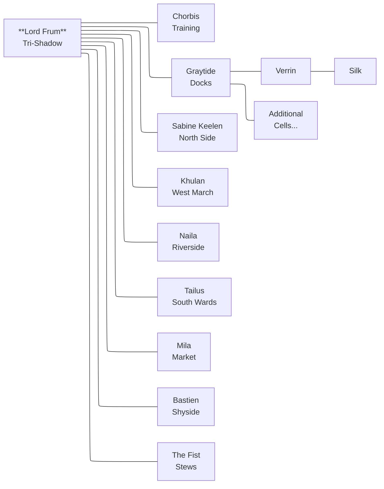

<figure>  <figcaption>The brotherhood symbol is a raven's head with a red eye.</figcaption> </figure>

Also known as the shadow fourth or the red eye. The brotherhood is the secret arm of the city, comprised of spies, thieves, enforcers, and assassins. **Lord Frum** is the head — the **Tri-Shadow** — of this web of spies, pickpockets, and criminals that are some three hundred strong. The symbol for the brotherhood is the raven.
Composition has a lot of feral.
Master Chorbis is in charge of recruitment and training, reporting directly to Lord Frum as a guild-level functionary rather than as a district cell leader.

<figure>  <figcaption>A chalked or scratched symbol of a feather also indicates the presence of the brotherhood.</figcaption> </figure>

Members of the brotherhood can be known by a symbolic pin on their person depending on their profession and a secret hand signal of thumbs joined with hands spread like wings.
## The Sanctuary
The brotherhood operates a secret underground base for operations, storage, and training deep under the city. There are mazes of tunnels, damp and dark, that lead from safehouses in the city. From the docks to the West March all is accessible to those that know. No one brother is exposed to the entire layout and often those in the outer cells are led blindfolded and earstopped for provisions, training, and instruction. It is said that Lord Frum has a complete and detailed map posted in his study, but few have seen it... or him.
## Recruitment
Enforcers and spies often are on the lookout for freelancers. They make a judgment call to ignore, warn, or recruit prospects. If warned, you have until dawn to vacate the city. If recruited, you are given a series of tests. If you fail, you are warned. If you pass the trials, you are in the brotherhood, for life, with opportunities for training, equipping, and mission assignments. Life in the brotherhood can be good, for those with talent, but you have little say over your destiny.
## Training
Training is not free except for the basics of your "job". You must demonstrate value by completing missions and receive chits that allow you to take advanced skills.
## Spy (Eye)

- Street awareness and rumor-gathering (listening, eavesdropping, reading crowds). 
- Disguise as harmless/poor, including acting, costume, and voice control.
- Panhandling and manipulation: sob stories, reading sympathy, baiting marks.  
- Concealed observation and shadowing while appearing idle or harmless.  
- Pickpocketing and cut-purse techniques from close contact with passersby.
- Contact network among other poor, informants, and petty criminals.  
## Thief (Wing)

- Stealth and silent movement, including fast stealth at near-full speed. 
- Lockpicking, trap handling, and delicate work on mechanisms and containers.
- Climbing walls, ledges, and rooftops; moving across difficult terrain and gaps. 
- Pickpocketing, sleight of hand, and palming or swapping small objects.
- Infiltration and scouting inside buildings, strongholds, and sewers.
- Escape artistry: slipping bonds, escaping grapples, and rapid getaway routes.
- Forgery of documents, seals, ledgers, and signatures to create or alter proof, passes, and identities.
## Assassin (Beak)

- Advanced stealth and ambush tactics, including killing from surprise. 
- Mastery of small weapons and precise strikes for vital targets. 
- Poison craft and application to blades, food, or darts.
- Disguise, false identities, and infiltration into guarded or high-society spaces.
- Observation and target study: routines, vulnerabilities, and guard patterns.  
- Clean-up skills: body disposal, staging accidents, and erasing traces.  
## Enforcer (Talon)

- Intimidation and interrogation to extract payments, information, or obedience.
- Close-quarters combat and brawling with fists, clubs, or heavy weapons.  
- Protection work: shielding VIPs, guarding territory, and watching for ambushes.  
- Tracking debtors, deserters, or traitors through streets and safehouses.  
- Crowd control and fear management during shakedowns or public displays of force.  
- Basic underworld logistics: organizing muscle, coordinating hits, and enforcing codes.  

Advancement in the guild to a cell leader, district boss, or even tri-shadow, the head of the guild is based on aptitude, effectiveness, and utility. Usually, upon retirement, a leader will appoint his or her successor. In the case of an unfortunate accident or forced removal, the guild head will get involved.
## Messaging

The brotherhood uses a cipher encoded onto raven's or other bird feathers for important communications. If you receive a feather, it is important to follow through. All members of the brotherhood learn the raven cipher so that reading it is as natural as breathing.

<figure>  <figcaption>Raven's feather with encoded message "Shadow and leech Lord Perry"</figcaption> </figure>

See [Raven's Feather Encoder/Decoder](../dev/raven-cipher.html) for more details.

The brotherhood also use hand signs and pins as a way of identifying themselves. Spies might have a red eye, thieves a feather, enforcers a talon, assassins a raven's head and beak. These are usually hidden and can be flashed at a fellow brother to identify people across cells. An example hand sign is the splayed raven.

<figure>  <figcaption>The sign of the raven, a common hand signal to identify yourself as a member of the brotherhood."</figcaption> </figure>

Messages, contracts, and instructions across cells are provided by dead drops, marks, and intermediaries, never face to face. 

Paper messages are either sealed and accompanied by a feather or sealed with the symbol of the district boss.
# Structure

The brotherhood is organized into cells whose goal is to enrich its members. 

Each cell consists of cross-section of skills: spy, thief, assassin, enforcer. Each cell has a cell boss, who knows the district boss and one other cell leader.  The cells are organized by  neighborhood. Freeport’s districts each have a distinct flavor in terms of people, trade, and how the Brotherhood exploits them. 
## Docks – Graytide
Graytide is an aging sea-wolf with scarred hands and a calm, measuring gaze, known for settling disputes with a quiet word and, failing that, a length of chain. He rose from deckhand to **enforcer**, and now rules the Docks through a tight crew of loyal lieutenants and informants among the ship-chandlers and harbor clerks.

Second only in ambition to Mistress Sabine, Graytide has the most lucrative district of them all. Everything flows through the docks and all into Graytide's pockets. His style is one of brawn over subtlety, which makes him more feared than admired but he still a strong contender for the brotherhood's ultimate leadership when Lord Frum retires.

The Brotherhood here controls night loading, berth assignments, and customs “errors,” skimming off every crate and arranging disappearances for items too hot to move openly. Smuggling, theft from warehouses and holds, intimidation of captains, and debt collection for waterfront moneylenders are routine business.

The Docks swarm with foreign sailors, ship’s officers, stevedores, and fishers, plus a layer of petty officials and tidehouse keepers who grease the wheels. It’s noisy, crowded, and volatile; one bad wage dispute or missing cargo can turn into a riot that Graytide is very good at steering to the Brotherhood’s advantage.
## North Upper – Mistress Sabine Keelen
Mistress Sabine Keelen, although a competent **spy** in her own right, presents herself as a discreet fixer for the city’s elite: impeccably dressed, soft-spoken, and terrifyingly well-informed. She cultivates a genteel salon near the Conclave where magistrates, priests from Pura Ecclesia, and senior officers are “helped” with delicate problems that then become leverage.

Mistress Sabine is keen to fill Lord Frum's shoes when he retires. As a result, she is ruthless and determined, often stretching her boundaries to exert control of the brotherhood outside the North Upper and bring in extra opportunities and income. The question on the other district bosses minds is "will she retire Lord Frum herself?". 

The Brotherhood’s activities here focus on blackmail files, forged charters and writs, altered tax records, and controlled leaks of scandal to ruin opponents at the right moment. Sabine’s people bribe scribes in the Grand Office, listen in at barracks messes, and place “penitents” in the ecclesiastical hierarchy to steer judgments. Inconvenient rivals can be eliminated as well, Sabine's elixers and poisons are non-paralleled.

North Upper is home to scholars, senior clergy, officers, advocates, and wealthy functionaries whose power is political rather than mercantile. Respectability is a mask; every household hides small sins and a few monstrous ones, which Sabine quietly tallies in ledgers bound in unmarked leather.
## West March – Khulan
Khulan is a foreign-born bravo turned financier, with a duelist’s poise and a merchant’s eye for risk, who now dresses in fine silks but still wears a sword at his hip. He built his position by acting as “problem-solver” for merchant houses, arranging accidents, debt restructurings, and the ruin of rivals who wouldn’t deal.

In West March, the Brotherhood specializes in white-collar crime: loan-sharking at a patrician scale, control of private guards, insider information on convoys, and manipulation of guild votes. Protection rackets are subtle: preferred access to guards, discreet arson against rivals, and quiet buyouts using laundered proceeds from other districts.

The district’s residents are wealthy merchants, minor nobility, elite factors, and senior bureaucrats who enjoy walled gardens, private chapels, and well-guarded counting houses. Outwardly it is the safest part of Freeport; in reality it’s where fortunes and careers vanish overnight under Khulan’s careful orchestration.
## Riverside – Naila
Naila is a former river pilot with sharp eyes and a sharper tongue, famous for knowing every backwater and towpath between Freeport and the hinterland. She runs her district from a modest waterside hall full of maps and river charts, where captains, barge-owners, and overseers come seeking passes, crews, or quiet revenge.

The Brotherhood’s trade here is in routing and information: arranging “mislays” of manifests, diverting barges to friendly warehouses, and controlling the hiring of trusted foremen and dock bosses along the riverfront. When needed, Naila’s people stage “accidents” on the water—snagged keels, cut tow ropes, sudden robberies at lonely bends.

Riverside’s people are respectable middle class: artisans with their own shops, ship captains with small stakes in their vessels, senior laborers, and minor officials who prefer coin over honor. It feels orderly and industrious by day, but at night inn parlors fill with quiet deals and river songs that carry more coded messages than sentiment.
## South Wards – Tailus
Tailus, once a carter and sometime brawler, is heavyset, soot-stained, and always smells faintly of forge-smoke and horse-sweat. He built power by organizing carters and teamsters into an unofficial guild that answers to him first, and to the city second, if at all.

Here the Brotherhood dominates logistics: monopolizing haulage contracts, skimming from warehouse inventories, and sabotaging wagons or animals of merchants who refuse to pay. Protection money buys safe transit through the Wards, priority for repairs at smithies and wheelwrights, and hired muscle when caravans need an escort on short notice.

South Wards folk are working merchants, carters, stable-hands, farriers, blacksmiths, and warehouse laborers, with families living above shops and yards. It is noisy and practical, loyal to those who provide steady work; most residents dislike the Brotherhood but also know Tailus is the reason their ledgers stay in the black. Tailus's territory ends at the Stews boundary — the flats and stilt-walkways are The Fist's domain, and the two cells maintain a careful operational separation.
## Market – Mila
Mila is a quick-witted trader’s daughter turned fixer, always in motion, with ink-stained fingers and a permanent half-smile that never quite reaches her eyes. She is beloved by stallholders for arranging permits and settling quarrels, and feared for an encyclopedic memory of who owes what to whom. A thief by trade, she now detailes in 

The Brotherhood in Market manipulates prices, controls stall allocations, fences stolen goods, and runs short-term “advance” schemes that leave desperate traders permanently indebted. Mila’s crew also has fingers in food adulteration, false weights, and quietly steering crowds toward favored vendors while spreading rumors against enemies.

Residents are a mix of shopkeepers, grocers, fish packers, porters, and small traders who rent cramped rooms behind their storefronts or above busy alleys. The district is dense, polyglot, and rumor-rich—exactly the kind of place where a clever operator can light or extinguish someone’s reputation in a single market-day.
## Shyside – Bastien
Bastien is a charming, aging rake with a gambler’s easy laugh and a stare that goes flat when money is on the table. He runs Shyside from a combination gaming house and brothel where sailors and laborers lose their coin, their secrets, and sometimes their futures.

Here the Brotherhood deals in vice: illicit gambling dens, brothels, rigged games, and a pervasive “protection” racket that keeps independent taverns nervous and compliant. Bastien also runs an informal information market, paying informants in drink and favors, then selling what he learns to Sabine, Khulan, or anyone who meets his price.

The people of Shyside are sailors between voyages, dock and warehouse workers, day laborers, and those who live hand-to-mouth in cheap lodgings. It’s rowdy, dangerous, and tightly packed, with a constant churn of faces—ideal cover for disappearances, secret meetings, and night-time violence.
## Stews – The Fist
“The Fist” is a nameless brute who took his moniker after crushing a rival leader’s skull in the mud; he rules the Stews by fear and brutal example. Though seemingly simple, he is canny enough to play different factions of the desperate poor against each other while skimming coin and favors for the Brotherhood’s higher echelons.

Brotherhood business here is the dirtiest: controlling street prostitution, press-ganging the desperate into dangerous work, organizing beggar rings, and hiding fugitives or contraband where no official wants to wade. Floods and collapsing walkways are opportunities—disaster relief shipments can be stolen, and the chaos covers disappearances.

The Stews’ population is the city’s most vulnerable: destitute families, refugees, temporary workers, the chronically ill, and feral children who know the stilt-walkways better than any guard. Life is precarious and short; loyalty is to kin, tenement, or gang rather than to Freeport itself, making the Stews a volatile powder-keg the Brotherhood can ignite or pacify as needed.

# The Raven’s Oath
In shadows deep, the raven flies,
Talons that rend the night, the enforcers’ might.
No mercy in their grip, no pity in their sight,
They bring the brotherhood’s justice to every fight.

Eyes like polished stones, the spies’ sharp gaze,
Watching from the eaves, through the darkest haze.
Secrets pass unseen, their sight cannot be traced,
The raven sees the truth, the world is unlaced.

Wings that steal the dawn, the thieves’ swift flight,
Silent as the grave, vanishing from sight.
They carry off the treasures, the knowledge, the prize,
Leaving only whispers beneath the starless skies.

Beaks that end the breath, the assassins’ knife,
Swift and cold as frost, they bring the final demise.
No warning, no reprieve, only the raven’s call,
Death is their promise, their gift to all.

This raven, dark and wise, the brotherhood’s own,
A shadow in the night, a herald all alone.
Its every part a weapon, every move a vow,
The raven’s oath is spoken: “Serve us now.”
## New Moves

### Craft an Item

*Moved to [[Craft an Item]].*
## New Assets

*Moved to [[Ironsworn Extensions]]: see the [[Bittercraft]] and [[Quillwise]] path assets.*
