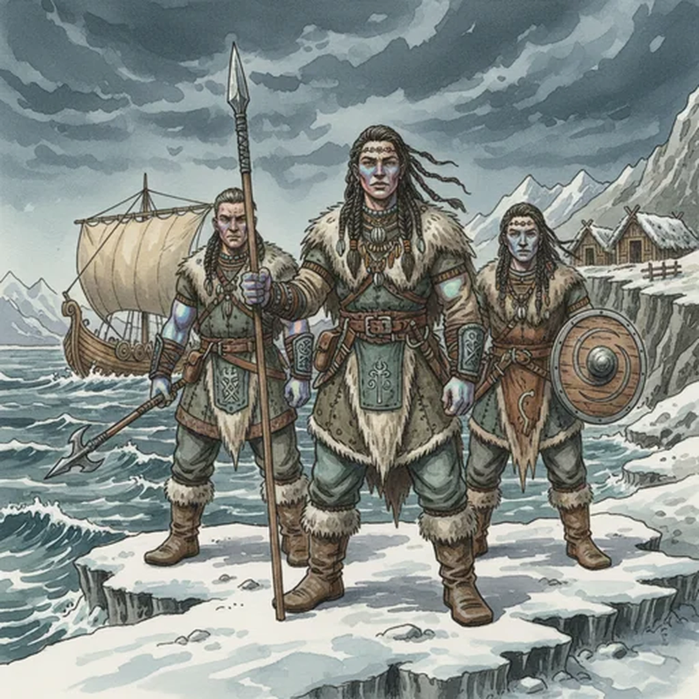

> [!warning] Generated file
> Creature from *Ironsworn: Delve* by Shawn Tomkin, used under CC BY 4.0. The **In YRT** reading is ours, from `extensions/yrt/foes/overrides.json` in the Iron Ledger repository. Edit it there and run `npm run ref` — changes made here are lost.

<figure>  <figcaption>Atanya</figcaption> </figure>

## Features
- Stout forms
- Iridescent skin and dark hair
- Clothed in hides and furs

## Drives
- Hunt and fish
- Respect the sea
- Seek out new lands

## Tactics
- Strike with spears
- Fight as one, and embody the power of the mighty sea

## Description
These people of the sea dwell among the Barrier Islands, along the Ragged Coast, and amid the frozen landscapes of the far north. Some live in isolated villages clinging to rugged shores, or as nomads among the icereaches. Others spend their lives aboard finely-crafted vessels called drift-homes. These ships find safe anchorage during the cruelest depths of winter, and return to the sea in calmer months.

The atanya are a diverse people, but most are well-suited to a life amid the northern climes. They are strong, hardy, and long-lived. Their height and stout forms give them an imposing physical presence, but they are generally good-natured. They have an unnatural sense of the coming weather and an innate understanding of the sea. Some say they once lived in the depths of the ocean, but were cursed by a forsaken god and banished to the world above.

## In YRT

In YRT: ordinary cold-adapted seafaring humans; their 'weather-sense' is experience, not mana. The forsaken-god origin is folk legend. If you want flavour, a mild Azure cultural practice (inherited medicinal traditions, topical cold-injury care) fits without changing them biologically.
