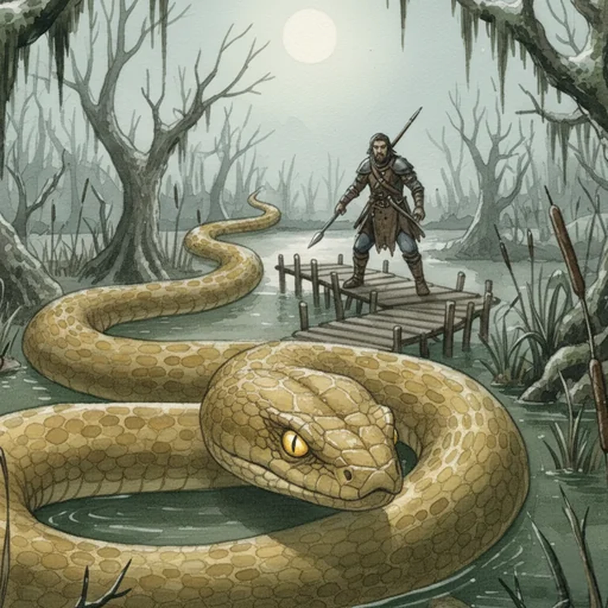

> [!warning] Generated file
> Creature from *Ironsworn* by Shawn Tomkin, used under CC BY 4.0. The **In YRT** reading is ours, from `extensions/yrt/foes/overrides.json` in the Iron Ledger repository. Edit it there and run `npm run ref`. Changes made here are lost.

<figure>  <figcaption>Basilisk</figcaption> </figure>

## Features
- Giant snake
- Dull yellow-brown skin
- Vibrant yellow eyes

## Drives
- Devour

## Tactics
- Lay in wait
- Mesmerizing gaze
- Sudden bite
- Crush

## Description
Basilisks dwell in the Flooded Lands, lurking in the murky waters of the swamps or within marshy thickets. There, they wait patiently for prey. They regularly feed on marsh rats or deer, but will eagerly make a meal out of a passing Ironlander.

## In YRT

In YRT: a giant snake. The 'mesmerising gaze' is either mundane predator stillness or a trace Amber organ behind the eyes — slow, short-range, effective on small prey only.
