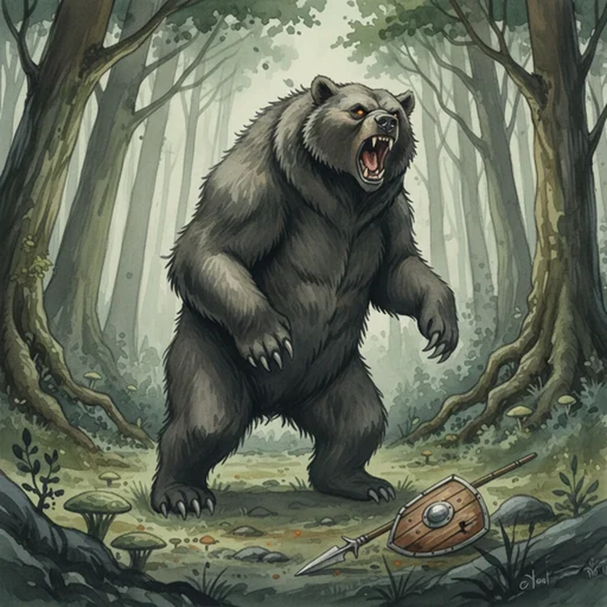

> [!warning] Generated file
> Creature from *Ironsworn* by Shawn Tomkin, used under CC BY 4.0. The **In YRT** reading is ours, from `extensions/yrt/foes/overrides.json` in the Iron Ledger repository. Edit it there and run `npm run ref`. Changes made here are lost.

<figure>  <figcaption>Bear</figcaption> </figure>

## Features
- Fearsome teeth and claws
- Thick hide

## Drives
- Find food
- Defend cubs

## Tactics
- Roar
- Pin down
- Maul with savage force

## Description
Most bears are not aggressive. They avoid Ironlanders and are unlikely to attack unless they see you as a threat.

There are exceptions. The silver bears of the Veiled Mountains, which sometimes range as far south as the Tempest Hills, are territorial, powerful, and aggressive. Likewise, the ash bear, encountered in woodlands through the Ironlands, is known for its ferocity and cunning. If either catch the scent of you on the wind, they are likely to hunt you down and attack.

## In YRT

In YRT: it's a bear.
