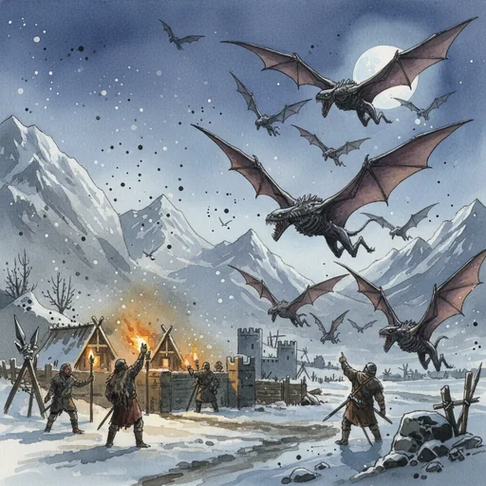

> [!warning] Generated file
> Creature from *Ironsworn: Delve* by Shawn Tomkin, used under CC BY 4.0. The **In YRT** reading is ours, from `extensions/yrt/foes/overrides.json` in the Iron Ledger repository. Edit it there and run `npm run ref`. Changes made here are lost.

<figure>  <figcaption>Bladewing</figcaption> </figure>

## Features
- Large, dagger-shaped wings
- Elongated jaws with needle-like teeth
- Dark, leathery hide

## Drives
- Take flight under the cover of darkness
- Hunt from above

## Tactics
- Glide silently
- Sudden, swift attack

## Description
These carnivorous creatures dwell in caves and ruins, and emerge at night to hunt. They have a lean, angular form, with a wingspan as wide as an Ironlander’s outstretched arms.

They typically feed on smaller prey, but a pack of hungry bladewings will harass larger victims, diving and slashing in coordinated attacks. During the long nights of winter, swarms of these creatures have descended on Ironlander settlements or unwary travelers.

## In YRT

In YRT: a mundane nocturnal predator with natural echolocation — no mana required. Optional trace Amber in the inner ear for sharper echolocation.
