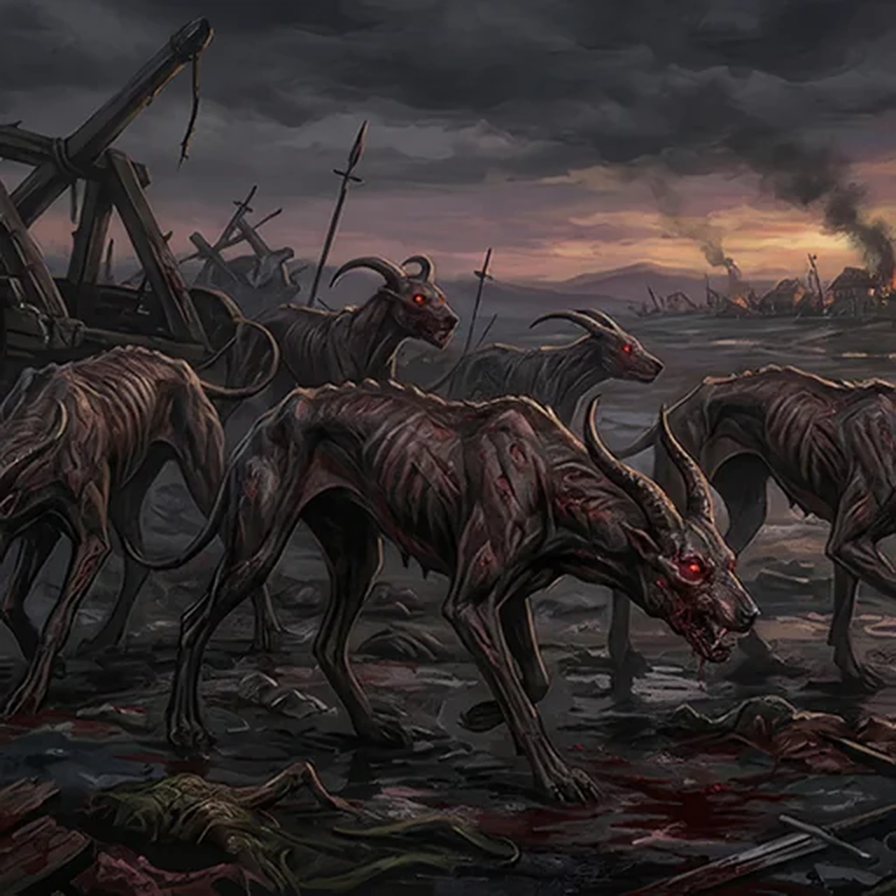

> [!warning] Generated file
> Creature from *Ironsworn: Delve* by Shawn Tomkin, used under CC BY 4.0. The **In YRT** reading is ours, from `extensions/yrt/foes/overrides.json` in the Iron Ledger repository. Edit it there and run `npm run ref` — changes made here are lost.

<figure>  <figcaption>Blighthound</figcaption> </figure>

## Features
- Red eyes
- Lean, hound-like form
- Curved horns

## Drives
- Portend death
- Fulfill the prophecy of death
- Lair in places where death is near

## Tactics
- Unearthly howl
- Piercing gaze
- Savage bite

## Description
Blighthounds lurk on blood-soaked battlefields, on the outskirts of settlements destined for famine, or within the dark catacombs of ancient tombs. Drawn to the dead, and foretelling great doom, they are capable predators and grim messengers of death.

They appear as gaunt, emaciated hounds, often mistaken for starving animals at first glance. Their fiendish form reveals itself in blood-red eyes, sweeping horns, and skin the texture of charred and blistered wood.

## In YRT

In YRT: a blight-zone apex scavenger. Gestation near Black and Crimson outcroppings produces the charred hide, red ocular fluorescence, horns, and heat-leeching breath. The 'death sense' is smelling decaying Black-exposed tissue at long range — drop the prophecy, keep the beast.
