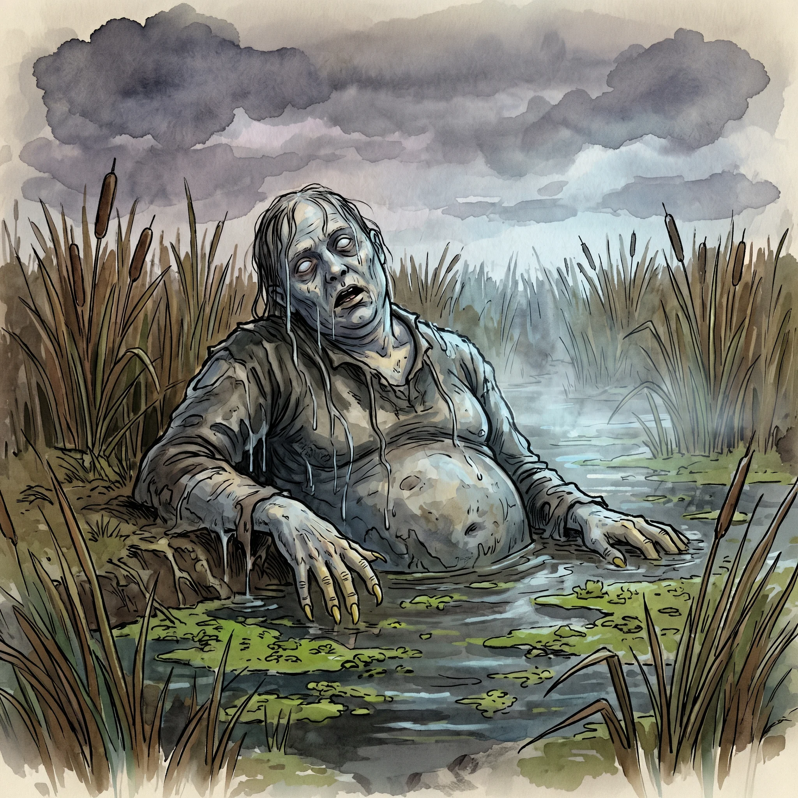

> [!warning] Generated file
> Built from `extensions/yrt/foes/foes.json` in the Iron Ledger repository. Edit it there and run `npm run ref` — changes made here are lost.

<figure>  <figcaption>A bloater — a corpse soaked for years in Azure-leaking water, kept soft and intact by the mana load and still capable of a crude reflexive grasp.</figcaption> </figure>

## Features
- Pale, swollen flesh, milky eyes
- Cold, wet skin even out of water
- Long fingernails grown post-death, curled and yellow
- Smells faintly of stagnant pondwater regardless of where encountered

## Drives
- Maintain proximity to standing water
- Grasp warm bodies that approach the water's edge

## Tactics
- Lie in shallow water, indistinguishable from a corpse, until something approaches
- Rise and grab with both hands
- Pull the victim into the water and hold them under
- Release and sink when the victim stops struggling

## Description
A bloater is a corpse that has spent years submerged in an Azure-leaking water source — an old well, a contaminated marsh, a flooded pre-Fall cellar. Azure mana is medical: it stitches wounds, repairs tissue, fights infection. In a corpse soaked in it long enough, those properties cumulate into a functional preservation that keeps the body soft, intact, and capable of crude reflexive movement.

A bloater does not pursue. It does not seek vengeance, does not regret its drowning, does not want company. It cannot leave the water for more than a few minutes before its tissues start to dry and crack. What it does have is a working spinal-reflex response to thermal differential and pressure changes nearby — the reflex is "grab, pull toward self, hold."

Bloaters break down eventually. Five to ten years is typical. The longest-lived examples are in deep, still water in pre-Fall ruins where the Azure leak is ongoing.
