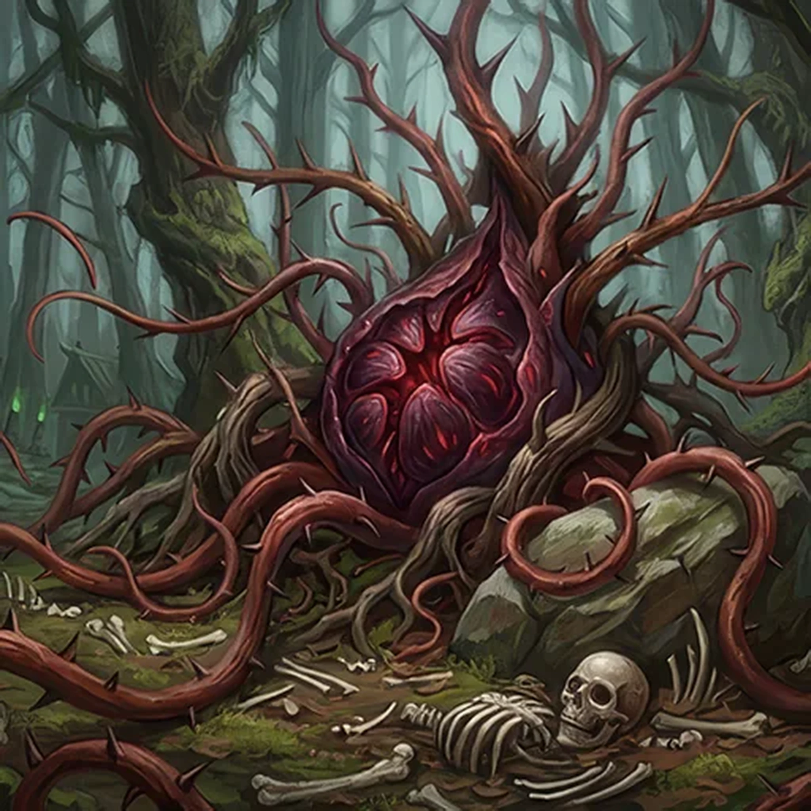

> [!warning] Generated file
> Creature from *Ironsworn: Delve* by Shawn Tomkin, used under CC BY 4.0. The **In YRT** reading is ours, from `extensions/yrt/foes/overrides.json` in the Iron Ledger repository. Edit it there and run `npm run ref` — changes made here are lost.

<figure>  <figcaption>Blood Thorn</figcaption> </figure>

## Features
- Thorn-tipped branches
- Scattered bones, stripped clean
- Large central pod

## Drives
- Consume blood
- Proliferate

## Tactics
- Lie in wait
- Grasp, entangle, and feed

## Description
A blood thorn is a malignant, carnivorous plant. It seizes its victims with long, creeping tendrils. Then, it leeches their life through hollow thorns, eventually bleeding them dry.

Blood thorns appear in woodland areas throughout the Ironlands. They are especially common in the Deep Wilds, where they often encircle elf villages. Some suspect they are cultivated by the elves, or share a symbiotic relationship with them.

## In YRT

In YRT: a carnivorous plant that grew up in a blight zone. Verdant drives the aggressive growth and tendril motion; Azure lets it extract and stitch new pods from prey blood. Green body, red-sheathed thorns, central pod acting as a crude natural seed.
