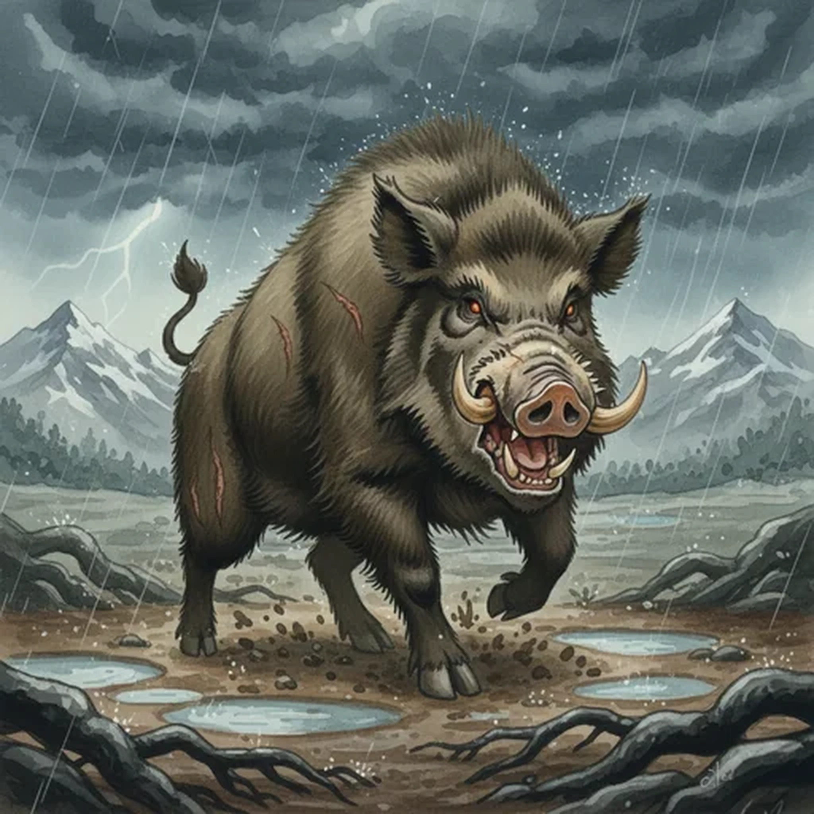

> [!warning] Generated file
> Creature from *Ironsworn* by Shawn Tomkin, used under CC BY 4.0. The **In YRT** reading is ours, from `extensions/yrt/foes/overrides.json` in the Iron Ledger repository. Edit it there and run `npm run ref`. Changes made here are lost.

<figure>  <figcaption>Boar</figcaption> </figure>

## Features
- Wiry coats
- Long tusks
- Vicious

## Drives
- Forage
- Protect territory
- Defend sows

## Tactics
- Charge and gore
- Circle and attack again

## Description
In the Old World, wild boars were belligerent and dangerous animals. Here in the Ironlands? They are even bigger and meaner. They will attack without warning or provocation. They will run you down, gore you, bite you, and circle around to do it all again. And again. And again.

## In YRT

In YRT: an oversized aggressive pig. If the size wants explaining, mild Azure in the local environment produces oversized wildlife generally — the same explanation covers elder beasts, gnarls, and mammoths in the same region.
