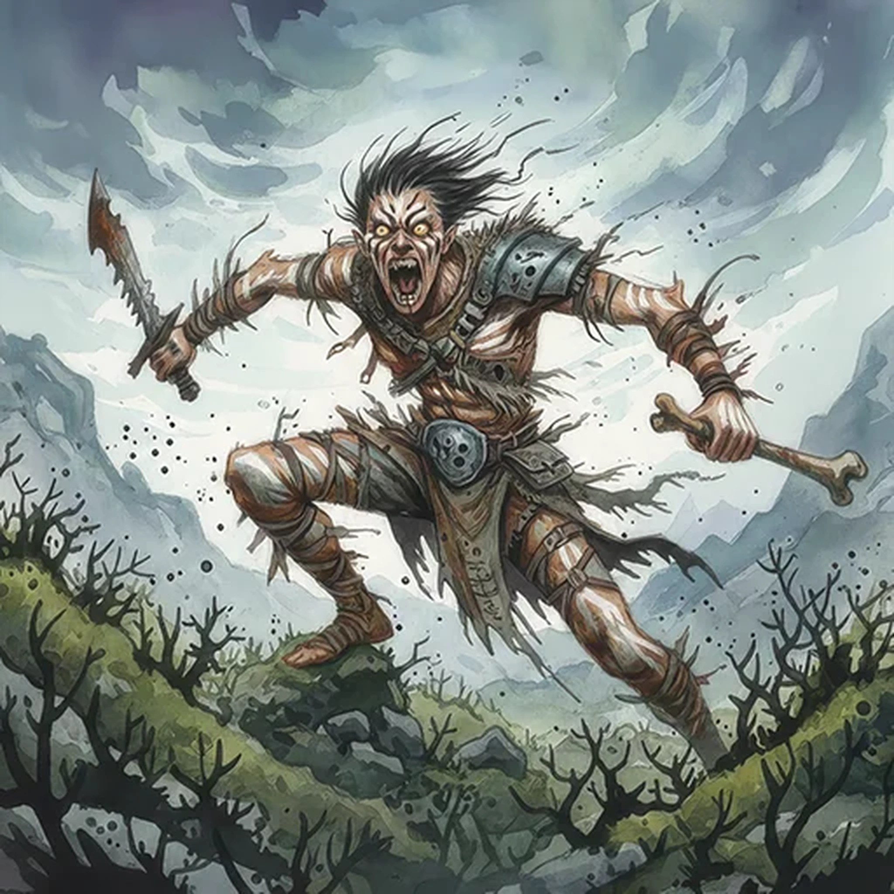

> [!warning] Generated file
> Creature from *Ironsworn* by Shawn Tomkin, used under CC BY 4.0. The **In YRT** reading is ours, from `extensions/yrt/foes/overrides.json` in the Iron Ledger repository. Edit it there and run `npm run ref`. Changes made here are lost.

<figure>  <figcaption>Broken</figcaption> </figure>

## Features
- Crazed eyes
- Painted skin
- Feral screams
- Scavenged clothing and weapons

## Drives
- Show my power
- Share my pain

## Tactics
- Spring from hiding
- Ferocious attacks

## Description
Another people sailed to the Ironlands from the Old World long before our kin settled here. Something happened. Something changed them.

Whether it was the long struggle in a harsh land, the ravages of war, or the corruption of some dark force, they left their humanity behind and became what we call the broken. Now, they exist only to kill, to destroy.

We fear the broken for their savagery. But, more than this, we fear them as a dark portent of what we might one day become.

## In YRT

In YRT: humans who have gone feral. If you want a cause, hint at long-term untreated Amber exposure from living on contaminated land — personality erosion matches the backlash description.
