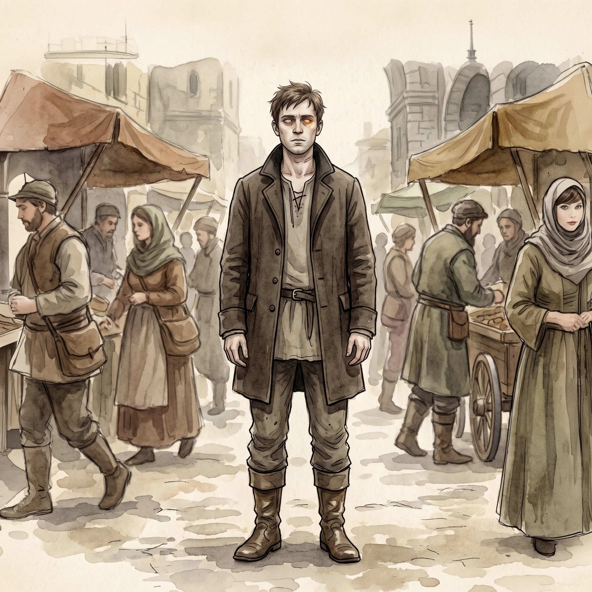

> [!warning] Generated file
> Built from `extensions/yrt/foes/foes.json` in the Iron Ledger repository. Edit it there and run `npm run ref`. Changes made here are lost.

<figure>  <figcaption>A carrier — a living person bearing an Amber compulsion-seed surgically implanted at the base of the skull, keyed to a trigger they usually do not know they carry.</figcaption> </figure>

## Features
- Sickly appearance, intermittent
- Periods of normal behaviour interrupted by sudden personality shifts
- Brief moments where the eyes lose their focus
- A small surgical scar at the base of the skull, easily missed

## Drives
- Pursue whatever the host originally wanted, on the surface
- Execute whatever the implanted seed demands, when triggered

## Tactics
- Behave normally until the trigger condition is met
- Lash out with unexpected strength when the seed activates
- Reveal the implant's true purpose through the host's mouth

## Description
A carrier is a living person who has had an Amber compulsion-seed surgically implanted at the base of their skull, usually without their knowledge. The seed is keyed to a trigger — a phrase, a sight, a name — and when triggered, it overrides the host's volition for a defined window. Some seeds are crude: kill the next person who says X. Some are sophisticated: gather information for a week, then deliver it to the following address. A handful are masterworks: take over the host entirely, run them as a puppet for a month, then dissolve and leave the host with no memory of any of it.

The implantation is illegal. The procedure is performed by a small number of black-market neuro-artificers — almost all of them disgraced Vizion who lost their Conclave licenses and went underground. The procedure carries a roughly thirty per cent mortality rate. Survivors often don't know they survived something.

The seed can be removed. The procedure is delicate, dangerous, and expensive. Conclave hospices in major cities will perform it for a substantial fee and without questions, on the understanding that the patient afterward becomes a Conclave informant for life.
