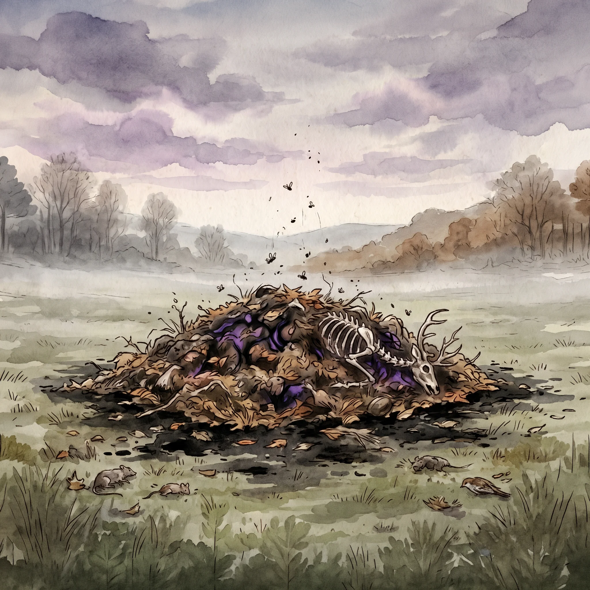

> [!warning] Generated file
> Built from `extensions/yrt/foes/foes.json` in the Iron Ledger repository. Edit it there and run `npm run ref` — changes made here are lost.

<figure>  <figcaption>A carrion mound — Black slurry heaped with rotting organic matter, drifting slowly across the landscape and dissolving anything organic it touches into itself.</figcaption> </figure>

## Features
- A slowly mobile heap of rotting organic matter — carrion, dead vegetation, sodden soil, spoiled grain — bound together by visible Black mana tracery
- Roughly the mass of a large dog at rest, growing as it feeds, but spread out horizontally rather than standing tall
- A constant slow heaving motion, as if something underneath is shifting
- The air around it is noticeably still; insects that approach fall out of the air and are absorbed

## Drives
- Dissolve organic matter into itself
- Drift slowly toward the largest source of organic decay nearby

## Tactics
- Move extremely slowly — a full day to cross a field
- Dissolve anything organic it touches on contact: leaf litter, carrion, fallen animals, sleeping creatures
- Absorb the dissolved mass into itself and grow
- Cannot be injured by physical attack — only Luminous warding or sustained intense heat can destroy it

## Description
A carrion mound is the inverse of a Locus. Where a Locus draws local matter into itself and grows, a carrion mound dissolves local matter into itself and grows. Where a Locus drifts toward mana flux, a carrion mound drifts toward organic decay. Where a Locus is dangerous because it is huge and unstoppable, a carrion mound is dangerous because it is silent, slow enough to be overlooked, and cannot be fought the way anything else can be fought.

Carrion-mounds form from leftover Black slurry — the same industrial-era disposal product that creates mire forms in bogs and rotwells in water. On dry ground, with sufficient organic matter nearby to feed on, the slurry does not stay put. It aggregates. Stray leaves, dead insects, fallen fruit, the occasional small animal that wandered too close — all are drawn to the slurry's Black gradient and dissolved into it on contact, adding their mass to the mound.

Over a season, a small slurry leak can produce a mound the size of a farm cart. Over a decade, one can become large enough to consume a small paddock and everything in it. The mound has no mind. It does not hunt. It does not retaliate when struck. Destroying a mound is possible but requires specific tools: Luminous warding disrupts the Black binding, or sustained intense heat burns off the organic content.
