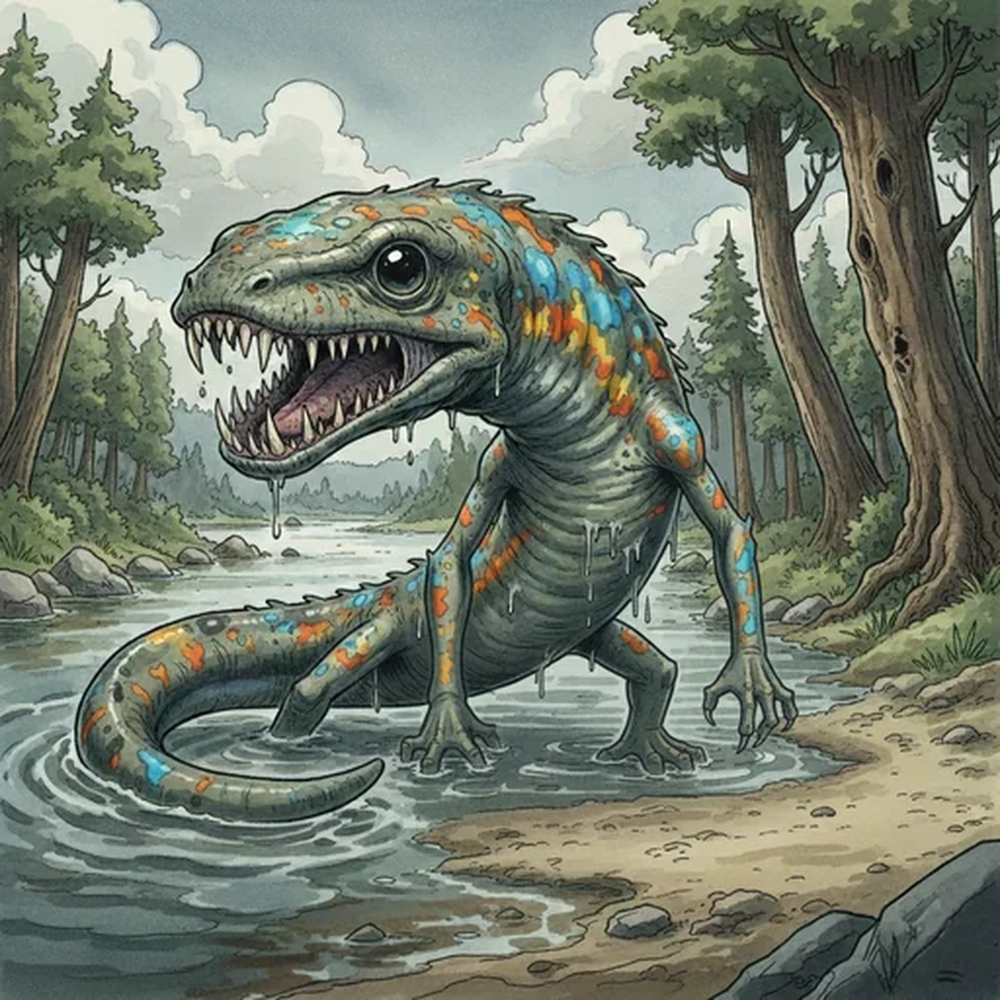

> [!warning] Generated file
> Creature from *Ironsworn: Delve* by Shawn Tomkin, used under CC BY 4.0. The **In YRT** reading is ours, from `extensions/yrt/foes/overrides.json` in the Iron Ledger repository. Edit it there and run `npm run ref` — changes made here are lost.

<figure>  <figcaption>Carrion Newt</figcaption> </figure>

## Features
- Long, sleek body
- Brightly-colored markings
- Serrated teeth

## Drives
- Hunt and feed
- Lay eggs within fresh kills

## Tactics
- Lurk in the shallows
- Sudden, ferocious attack
- Unyielding bite

## Description
These semiaquatic creatures dwell within the freshwater rivers and subterranean waterways of the Ironlands. They have a long, eel-like body, a flat head, and short, claw-tipped legs.

A mature adult grows to the length of a horse. They are ungainly on land, but fast and agile within the water. They prefer to attack landbound prey by lurking along the water’s edge and waiting for an unfortunate animal (or Ironlander) to come near their hiding spot.

Carrion newts lay their eggs within the carcass of their kills. The rotting body nurtures the eggs and feeds the young newts until they burst forth into the world. If you come upon a corpse at the water’s edge—be cautious. It might be filled with dozens of hungry young newts.

## In YRT

In YRT: an ordinary large amphibian. Optional Verdant trace in eggs that incubate in rotting flesh — a Verdant/decay boundary niche.
