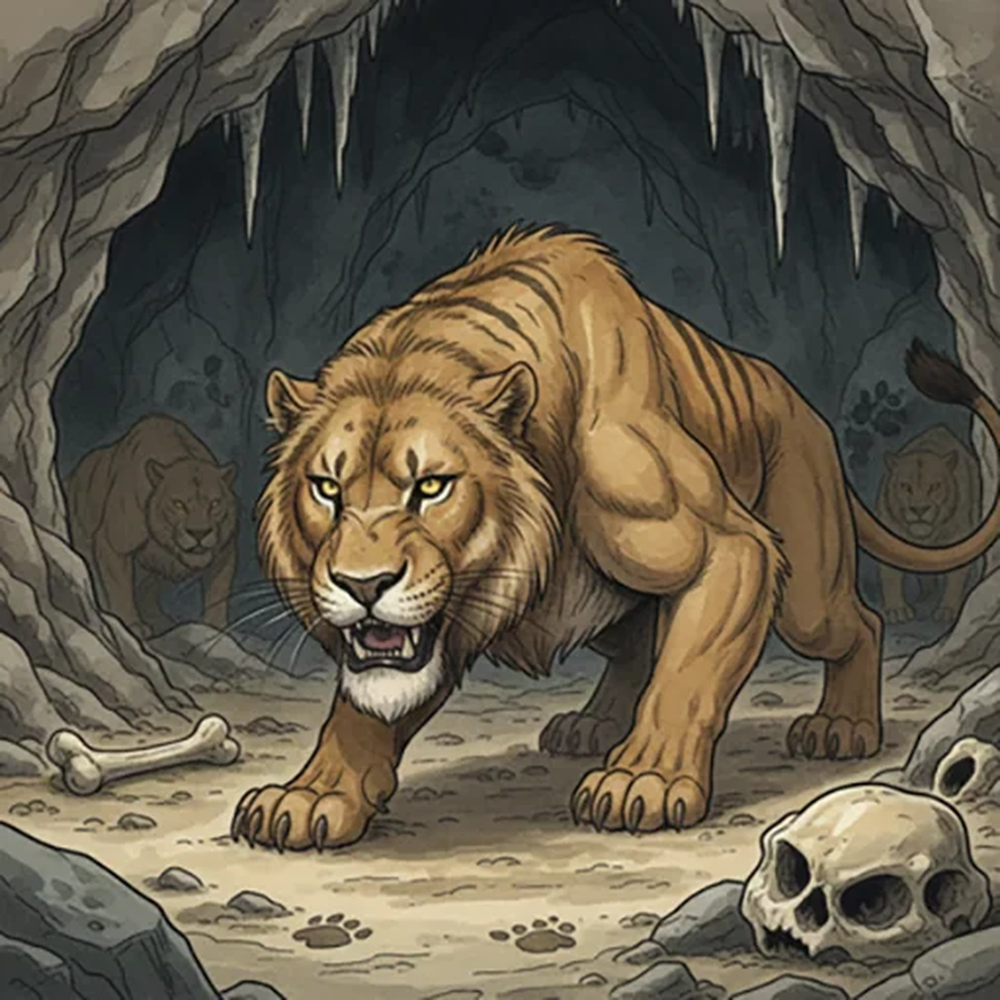

> [!warning] Generated file
> Creature from *Ironsworn: Delve* by Shawn Tomkin, used under CC BY 4.0. The **In YRT** reading is ours, from `extensions/yrt/foes/overrides.json` in the Iron Ledger repository. Edit it there and run `npm run ref` — changes made here are lost.

<figure>  <figcaption>Cave Lion</figcaption> </figure>

## Features
- Feline grace
- Tawny, striped coat

## Drives
- Hunt

## Tactics
- Stalk prey
- Leap and bite
- Intimidating roar

## Description
Cave lions are sleek, powerful creatures who dwell primarily in the Hinterlands and Tempest Hills. They lair in caverns and other hidden places, emerging to hunt prey such as deer, boar, and rodents. They are typically solitary creatures, but have been seen working together to bring down larger quarry. Even a mammoth is no match for a determined pack of cave lions.

## In YRT

In YRT: a mundane big cat. No changes needed.
