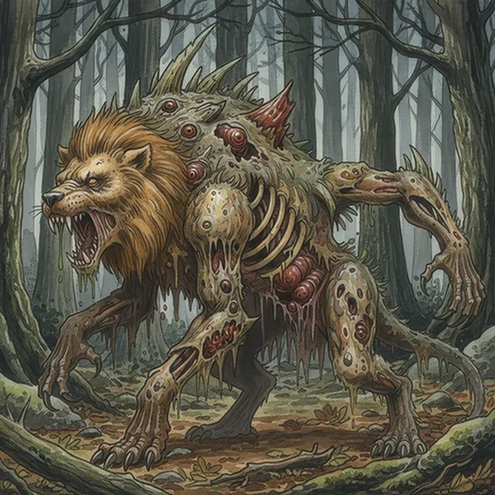

> [!warning] Generated file
> Creature from *Ironsworn* by Shawn Tomkin, used under CC BY 4.0. The **In YRT** reading is ours, from `extensions/yrt/foes/overrides.json` in the Iron Ledger repository. Edit it there and run `npm run ref` — changes made here are lost.

<figure>  <figcaption>Chimera</figcaption> </figure>

## Features
- Shambling mass of dead creatures and offal
- Rotting stench

## Drives
- Insatiable hunger

## Tactics
- Horrifying wail
- Relentless assault
- Claw, bite and rend

## Description
A chimera is the corrupted form of animal flesh given unnatural life. Its body is a collection of various dead creatures, fused together into a twisted, massive entity which knows only pain and hunger. When a dozen blood-tinged eyes focus on you, when its gibbering mouths open at once to scream, your only hope is a quick death.

## In YRT

In YRT: an unstable Verdant + Azure + Black grafting experiment — someone tried to make a living construct from carrion and it kept moving. Azure fuses tissue, Verdant grows and self-repairs, Black tolerates dead material as substrate. It eats, screams, attacks — no higher cognition.
