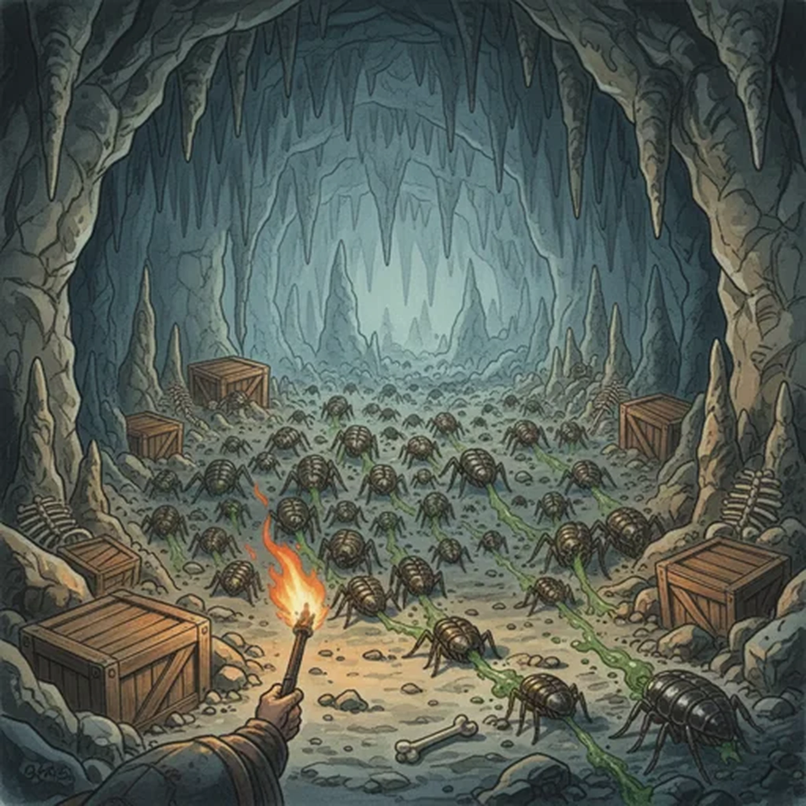

> [!warning] Generated file
> Creature from *Ironsworn: Delve* by Shawn Tomkin, used under CC BY 4.0. The **In YRT** reading is ours, from `extensions/yrt/foes/overrides.json` in the Iron Ledger repository. Edit it there and run `npm run ref`. Changes made here are lost.

<figure>  <figcaption>Chitter</figcaption> </figure>

## Features
- Chitinous shell
- Snapping mandibles

## Drives
- Sniff out food
- Defend the nest

## Tactics
- Summon the horde
- Swarm and bite
- Spew putrid vomit

## Description
Chitters are unnaturally large insects which dwell underground, nesting in subterranean caves, ruins and barrows. They stand half the height of an Ironlander, and move on six segmented legs.

They are primarily scavengers, using their keen sense of smell to locate and retrieve carcasses above or below ground. Instead of eyes, chitters have three thumb-sized holes in the center of their heads through which they issue a distinctive twittering sound. This call is used to communicate with others of its kind and to help visualize their surroundings—much like bats find their way in darkness.

They are covered in a rigid shell, and their mandibles are as sharp and destructive as a finely forged blade. They are not necessarily hostile, but will aggressively defend their nests or fight to secure a food source.

As a last resort, a chitter may attack by spewing the contents of its stomach in a noxious spray, leaving all but the hardiest of Ironlanders temporarily blinded and retching.

## In YRT

In YRT: a blight-adapted giant insect. Azure drives the scale-up, chitin regeneration, and digestive-slurry vomit; faint Amber the twittering call used for spatial mapping. Grey-brown carapace, yellowish vomit.
