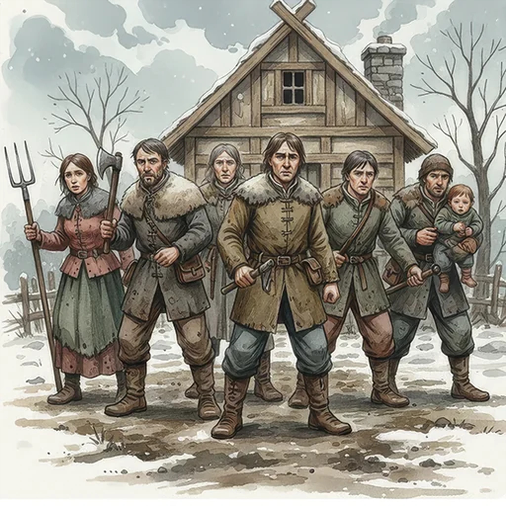

> [!warning] Generated file
> Creature from *Ironsworn* by Shawn Tomkin, used under CC BY 4.0. The **In YRT** reading is ours, from `extensions/yrt/foes/overrides.json` in the Iron Ledger repository. Edit it there and run `npm run ref` — changes made here are lost.

<figure>  <figcaption>Common Folk</figcaption> </figure>

## Features
- Diverse looks
- Weary and worried
- Suspicious of strangers

## Drives
- Prepare for winter
- Protect my family

## Tactics
- Desperate defense
- Stand together

## Description
Most of us in the Ironlands are common folk. We are farmers, laborers, crafters, sailors, and traders. When trouble comes, we know which way the pointy end goes and we stand together to protect our homes and kin.

## In YRT

In YRT: humans.
