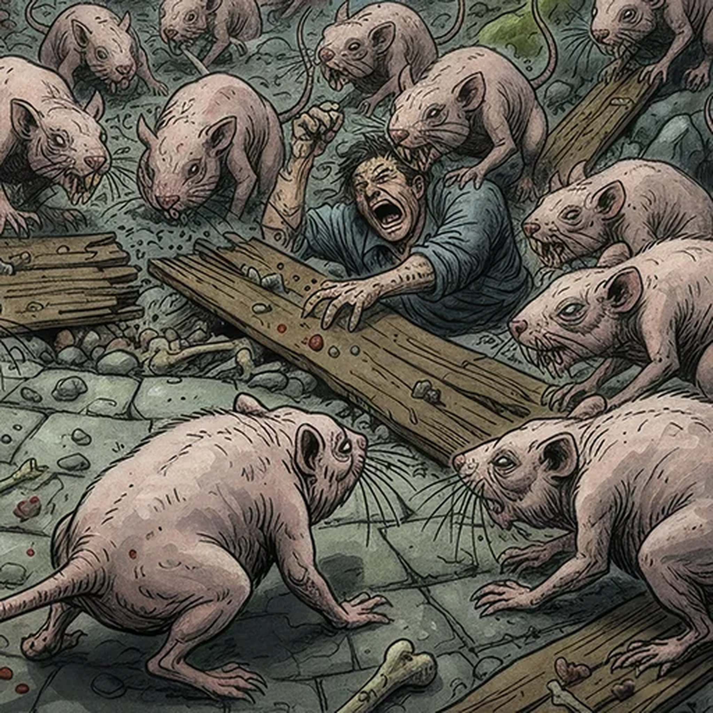

> [!warning] Generated file
> Creature from *Ironsworn: Delve* by Shawn Tomkin, used under CC BY 4.0. The **In YRT** reading is ours, from `extensions/yrt/foes/overrides.json` in the Iron Ledger repository. Edit it there and run `npm run ref`. Changes made here are lost.

<figure>  <figcaption>Deep Rat</figcaption> </figure>

## Features
- Tiny, blind eyes
- Wrinkled, hairless skin
- Clawed feet
- Jutting incisors

## Drives
- Dig
- Feed

## Tactics
- Undermine paths
- Swarm and bite

## Description
These foul, oversized rats have squat bodies and stubby tails. They are essentially blind, but navigate through smell and touch.

Deep rats are constantly collecting food and will eat anything even vaguely edible. They often dwell in caves or subterranean structures, digging compulsively to expand their lair. In those places, they serve as fodder for greater creatures.

## In YRT

In YRT: a mundane naked-mole-rat analogue. No mana required.
