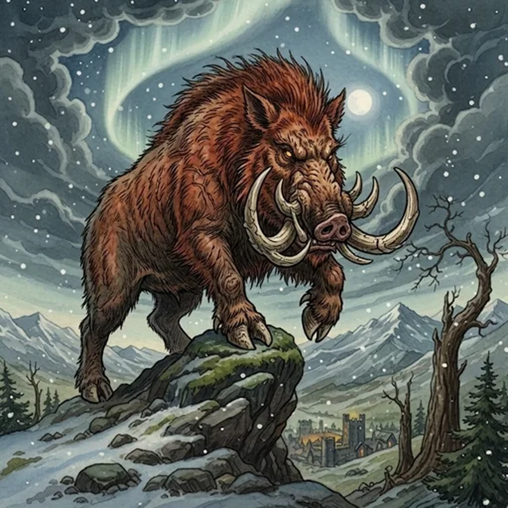

> [!warning] Generated file
> Creature from *Ironsworn* by Shawn Tomkin, used under CC BY 4.0. The **In YRT** reading is ours, from `extensions/yrt/foes/overrides.json` in the Iron Ledger repository. Edit it there and run `npm run ref`. Changes made here are lost.

<figure>  <figcaption>Elder Beast</figcaption> </figure>

## Features
- Twice the size of their common kin, or more
- Red eyes

## Drives
- Dominate

## Tactics
- Intimidating display
- Overwhelming attack

## Description
Elder beasts—wolves, bears and boars—are huge, monstrous versions of their common kin. They are primarily solitary creatures, though elder wolves have been known to lead a pack of common wolves. They are not aggressive, but are protective of their lands and the creatures within it. Some say they are avatars of the old gods and as long-lived as the oldest trees.

## In YRT

In YRT: oversized wolves, bears, or boars gestated near a stable long-standing blight zone. Azure drives the size and longevity; trace Crimson gives the red-glowing eyes. The 'avatars of the old gods, long-lived as trees' is folk belief.
