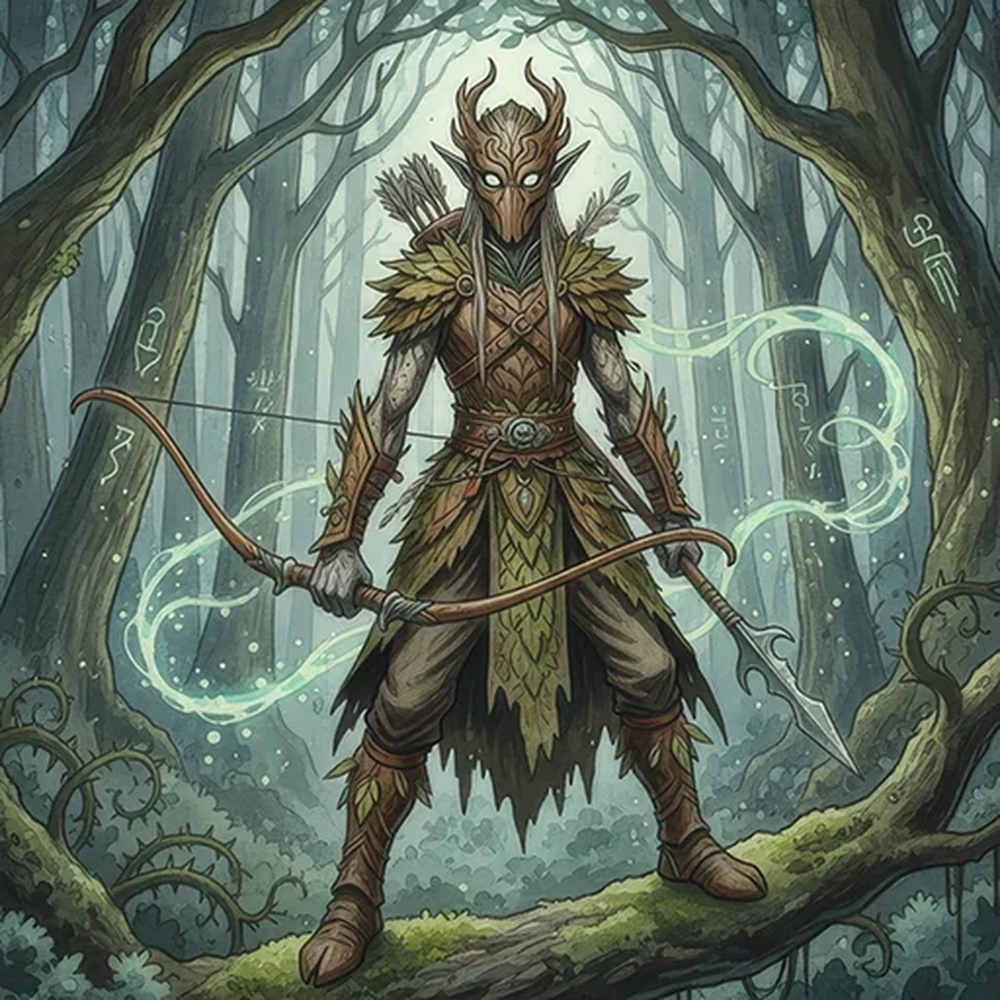

> [!warning] Generated file
> Creature from *Ironsworn* by Shawn Tomkin, used under CC BY 4.0. The **In YRT** reading is ours, from `extensions/yrt/foes/overrides.json` in the Iron Ledger repository. Edit it there and run `npm run ref`. Changes made here are lost.

<figure>  <figcaption>Elf</figcaption> </figure>

## Features
- Large, luminous eyes seen through wooden masks
- Gray-green skin the texture of dry leaves
- Sonorous voices
- Wielding bows and spears

## Drives
- Protect the wilds
- Drive out trespassers, or see them pay

## Tactics
- Strike from shadow
- Force their surrender
- Turn the forest against them

## Description
Elves are strange beings of the forest, seldom seen beyond the ancient woods of the Deep Wilds. They are fiercely protective of their lands and suspicious of humans. Their scouts patrol the borderlands, riding the fearsome mounts we call gaunts. Others of their kind watch us from the shadow of the deep woods, spears and bow at the ready. Some say elven mystics can bind the animals and beasts of the forest to aid in the defense of the Wilds.

A few warn that the elves are biding their time, readying the attack which will drive us from these lands.

## In YRT

In YRT, called the Verdani — a humanoid species shaped over generations by sustained deep Verdant exposure, historically tied to farms, bio-preserves, and the great mana estates of the pre-scarcity era. Once widespread wherever green mana reservoirs flourished; now rare, holding the remaining preserves they tend. 'Binding animals to aid in defence' is skilled Verdant and Amber use: long-term training reinforced by scent-compulsion seeds. Wooden masks contain Amber-tuning channels. The Conclave dislikes their Mask-Risen practice but has not stopped it.
