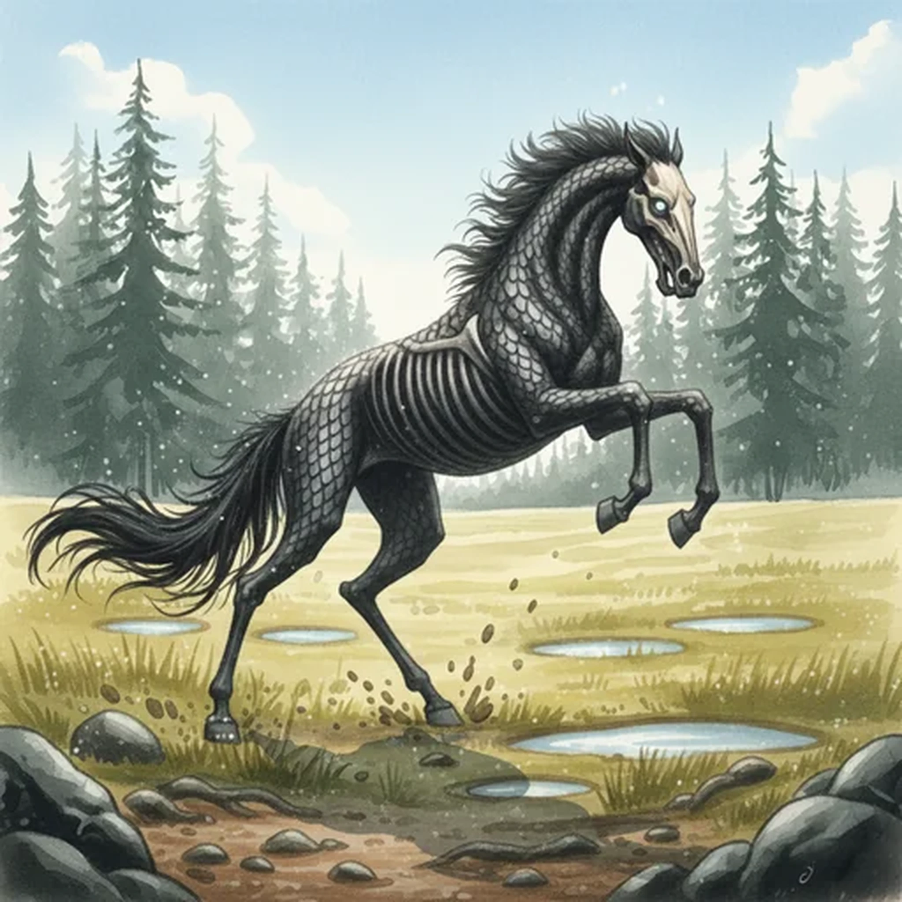

> [!warning] Generated file
> Creature from *Ironsworn* by Shawn Tomkin, used under CC BY 4.0. The **In YRT** reading is ours, from `extensions/yrt/foes/overrides.json` in the Iron Ledger repository. Edit it there and run `npm run ref`. Changes made here are lost.

<figure>  <figcaption>Gaunt</figcaption> </figure>

## Features
- Horse-like creature with a lean, skeletal frame
- Ghostly pale eyes
- Black, scaled hide

## Drives
- Run like the wind

## Tactics
- Rear up
- Charge
- Trample

## Description
A gaunt is a creature unique to the Ironlands. They maneuver across the rough, dense terrain of the Deep Wilds and Hinterlands with uncanny speed and grace. This makes them ideal as mounts for the elves, who breed and train them.

A gaunt will not usually act aggressively without provocation, but they are as deadly as the fiercest warhorse under the command of a talented rider.

## In YRT

In YRT: a blight-adapted grazer bred by the Verdani. Gray gives the scaled hide for protection; faint Luminous explains the pale-eye glow. An unusual species, not supernatural.
