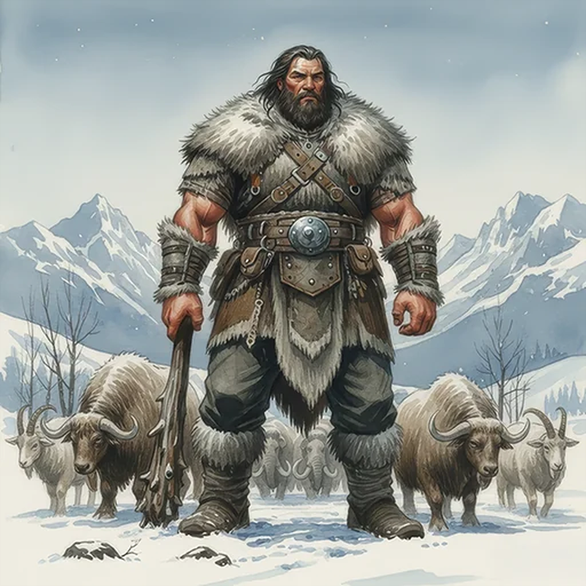

> [!warning] Generated file
> Creature from *Ironsworn* by Shawn Tomkin, used under CC BY 4.0. The **In YRT** reading is ours, from `extensions/yrt/foes/overrides.json` in the Iron Ledger repository. Edit it there and run `npm run ref` — changes made here are lost.

<figure>  <figcaption>Giant</figcaption> </figure>

## Features
- Dark hair and ruddy skin
- Twice the size of a tall man, or more
- Wearing layers of wool, hide and furs
- Stoic and observant

## Drives
- Survive the winter
- Protect the herd

## Tactics
- Fight as a last resort
- Sweeping strike
- Make them flee

## Description
Giants dwell in the Tempest Hills and Veiled Mountains. They live a nomadic life alone or in small family units, herding oxen, mountain goats, and sheep. In their own language they are called the Jokul.

Many Ironlanders misinterpret their quiet nature for dullness, but giants are keenly intelligent and observant. They have a great respect for life, even for our kind, and will use trickery and negotiation to avoid a fight. When they are left without other options, an enraged giant is a devastating, relentless force.

## In YRT

In YRT: an unusually tall humanoid species, or a mountain-adapted subculture of humans. If you want biological flavour, regional Verdant exposure produces larger humans over generations — same explanation as elder beasts.
