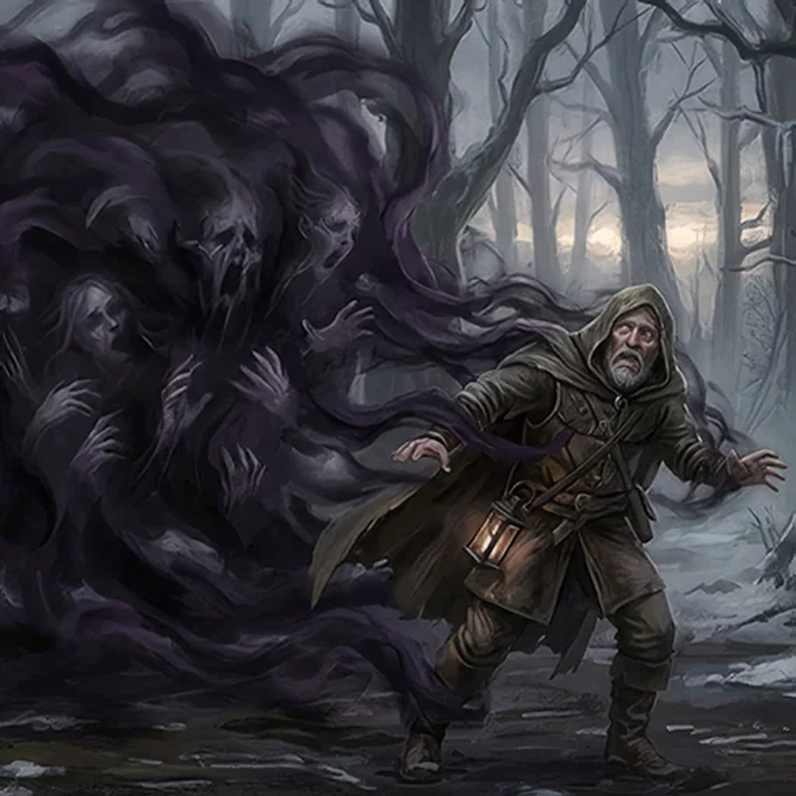

> [!warning] Generated file
> Creature from *Ironsworn: Delve* by Shawn Tomkin, used under CC BY 4.0. The **In YRT** reading is ours, from `extensions/yrt/foes/overrides.json` in the Iron Ledger repository. Edit it there and run `npm run ref` — changes made here are lost.

<figure>  <figcaption>Gloom</figcaption> </figure>

## Features
- Creeping, vaporous murk
- Whispers and illusions

## Drives
- Envelop all in shadow
- Feed on fear and despair

## Tactics
- Lure with trickery
- Snuff out lights
- Surround and engulf
- Show painful and horrifying visions

## Description
A gloom is a mass of malignant shadow. It dwells in dark places beneath the earth, or in the shadows of thick woods. At twilight and during the long gray days of winter, it emerges from its lightless refuge to sate its hunger.

The gloom’s amorphous form cannot exert physical force. Instead, it will draw in its victims through illusion, mimicking familiar voices or forms. Or it will use the cover of darkness to ambush unwary prey. Once enveloped, the victim is a captive audience for the gloom’s apparitions, forced to face their innermost doubts and fears. The gloom picks at their sanity like a scavenger cleaning meat from bones. After a time, there is nothing left but an empty shell.

If trapped within a gloom, let your conviction and courage be your light. Against hopelessness, find hope. Against despair, find peace of mind. Against terror, find faith. In the darkness, it is not the gloom that is your enemy. It is yourself.

## In YRT

In YRT: an unbound Amber + Black wild-mana phenomenon in dark, still places — not intelligent, a self-sustaining mana weather system drifting along gradients of warmth and prey. Amber drives the illusions, voice mimicry, and fear induction; Black is the shadow-mass itself and the life-leech on enveloped prey. Oily black with flickering amber edges where it touches minds. The 'mind like a crow picks at carrion' is a description of Amber backlash effects, not malice.
