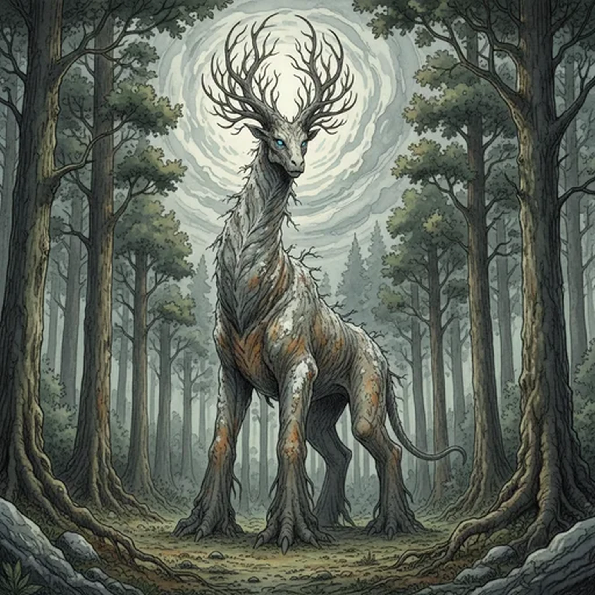

> [!warning] Generated file
> Creature from *Ironsworn: Delve* by Shawn Tomkin, used under CC BY 4.0. The **In YRT** reading is ours, from `extensions/yrt/foes/overrides.json` in the Iron Ledger repository. Edit it there and run `npm run ref`. Changes made here are lost.

<figure>  <figcaption>Gnarl</figcaption> </figure>

## Features
- Thick, sturdy legs
- Tough hide, textured like old bark
- Majestic horns
- Sorrowful call

## Drives
- Keep to the woodlands
- Forage

## Tactics
- Threatening posture
- Powerful charge
- Stomp

## Description
Gnarls dwell in woodlands throughout the Ironlands. The tallest of them are nearly the height of towering trees, with a long neck and legs as stout as trunks. Atop their heads are sprays of horns which twist and intertwine like slender branches. They roam the forest alone or in small family groups, feeding on lichen, leaves, and other plants. They are not naturally aggressive, but are mighty foes when threatened.

The color of a gnarl’s bark-like hide changes through its life, emulating the passage of the seasons. A young gnarl’s hide is the verdant green of spring. As they mature, it transitions to the deeper brown-green of summer, then the burnished amber of fall, and finally the cold gray of winter. To protect itself from potential predators, a gnarl will stand among a copse of trees. It will plant its feet, straighten its back, stretch its neck, and stay perfectly still, blending in with its surroundings.

The low, resonant call of a gnarl can carry for miles. It is a lonely sound, as evocative and heartrending as the most mournful funeral song.

## In YRT

In YRT: a huge forest herbivore symbiotic with Verdant mana. Verdant drives hide pigmentation, seasonal colour shift, longevity, and antler growth; Gray gives the bark-textured dermal layer. Hide shifts green / amber / russet / bare-brown through its life.
