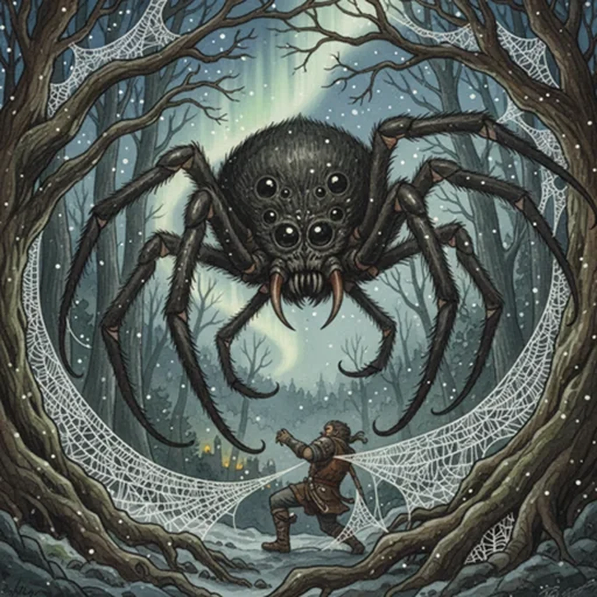

> [!warning] Generated file
> Creature from *Ironsworn* by Shawn Tomkin, used under CC BY 4.0. The **In YRT** reading is ours, from `extensions/yrt/foes/overrides.json` in the Iron Ledger repository. Edit it there and run `npm run ref`. Changes made here are lost.

<figure>  <figcaption>Harrow Spider</figcaption> </figure>

## Features
- Massive fangs
- Long legs and bloated body
- Eight iridescent black eyes

## Drives
- Lurk
- Feed

## Tactics
- Drop atop prey
- Bite with pincers
- Trap in webbing

## Description
These gigantic creatures are a menace in woodlands throughout the Ironlands. Despite their size, they move through high branches with unnatural grace, dropping suddenly to grapple their prey and entomb them in webbing.

## In YRT

In YRT: a giant spider — Verdant-tinted gigantism, otherwise a normal arachnid. Iridescent black eyes come from trace Amber/Gray in the lens tissue, not functionally magical.
