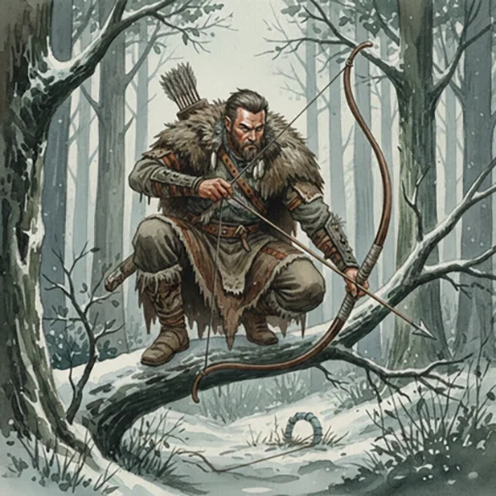

> [!warning] Generated file
> Creature from *Ironsworn* by Shawn Tomkin, used under CC BY 4.0. The **In YRT** reading is ours, from `extensions/yrt/foes/overrides.json` in the Iron Ledger repository. Edit it there and run `npm run ref`. Changes made here are lost.

<figure>  <figcaption>Hunter</figcaption> </figure>

## Features
- Wearing hides and furs to ward away the cold
- Steely gaze
- At home in the woodlands

## Drives
- A clean kill
- Survive the hunt

## Tactics
- Set traps
- Keep to the shadows
- Deadly shot

## Description
Hunters face brutal weather, difficult terrain, dangerous animals, and worse. Many never return from their hunts. Others return, but are forever changed.

## In YRT

In YRT: human.
