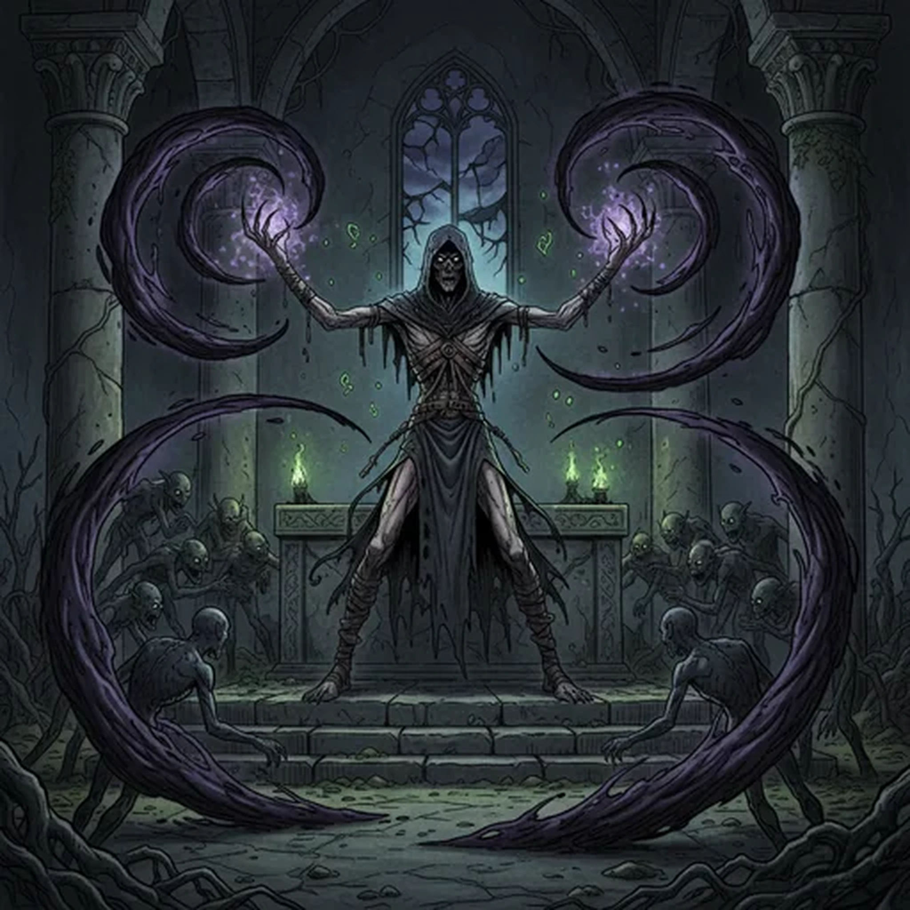

> [!warning] Generated file
> Creature from *Ironsworn: Delve* by Shawn Tomkin, used under CC BY 4.0. The **In YRT** reading is ours, from `extensions/yrt/foes/overrides.json` in the Iron Ledger repository. Edit it there and run `npm run ref`. Changes made here are lost.

<figure>  <figcaption>Husk</figcaption> </figure>

## Features
- Withered flesh and black eyes
- Clawed fingernails
- Horrifying wail
- Become more powerful

## Drives
- Make others suffer as they have
- Restore their former self

## Tactics
- Dishearten with a dreadful howl
- Lash out with forbidden magic
- Bind lesser creatures to their will
- Consume the essence of others

## Description
A husk is what remains of an Ironlander whose body, mind, and soul are hollowed out by dark magic. In their unquenchable thirst for power, they use their own essence to power foul rituals. Bit by bit, they give themselves to this ruinous path. They abandon their kin. They forsake their former lives. Their physical form wastes away. Their mind is shattered.

In time, only the husk is left. They are a needful thing, tormented by the memory of all they have lost, but willing to lose even more in their quest for power.

A husk may make tempting offers of rituals or rarities, but be wary. Their bargains are always in their own favor. When they turn against you, a husk is a cunning foe. They weave dreadful spells, summon swarms of lesser creatures, and unleash a savagery inflamed by their anguish.

## In YRT

In YRT: the walking worst-case outcome of the mana-backlash oracle — a wizard who over-drew on Black, Amber, and Crimson and survived in a ruined state. 'Forever hungry' is mana addiction. Black for decay and life-leech, Amber for compulsion and extracting mana from others, Crimson for the forbidden attack magic.
