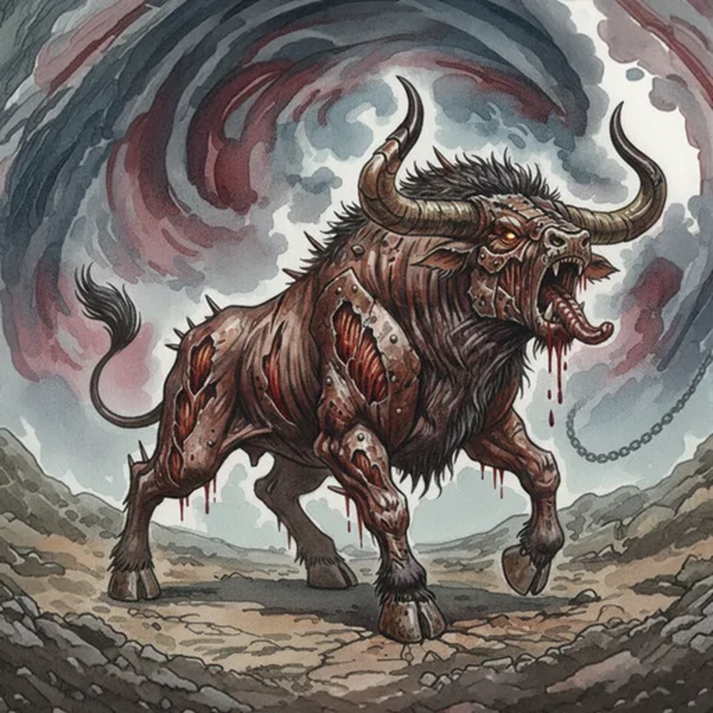

> [!warning] Generated file
> Creature from *Ironsworn: Delve* by Shawn Tomkin, used under CC BY 4.0. The **In YRT** reading is ours, from `extensions/yrt/foes/overrides.json` in the Iron Ledger repository. Edit it there and run `npm run ref` — changes made here are lost.

<figure>  <figcaption>Iron-Wracked Beast</figcaption> </figure>

## Features
- Flesh corrupted by iron
- Pained howl

## Drives
- Feed the insatiable hunger
- Destroy those who wield iron
- Find a release from pain

## Tactics
- Attack with brutal rage
- Bite and devour

## Description
We don’t know the origin of the Iron Blight, nor do we know its cure. It inflicts creatures of the wilds and transforms their flesh slowly to iron. These pitiful but powerful beasts are scarred by patches of metal flesh within ragged, weeping wounds. The iron is like a parasite, devouring the host as it torments them with unstoppable pain and insatiable hunger. Their howls echo with animalistic agony and the clangor of hammer against anvil.

In time, the Blight takes too much, and the beast dies while it is still more flesh than iron. We pray a creature never survives beyond that stage. What would it become?

## In YRT

In YRT: an industrial-era contamination victim. Free Gray mana from a ruptured pre-Fall site converts the animal's tissue into a structural lattice — a slow, agonising transformation. Crimson residue drives the pain, the heat, and the howl. Iron-grey patches in weeping red flesh. The 'hammer on anvil' sound is Gray crystallisation inside muscle tissue. The 'Iron Blight' is a local name for the industrial contamination gradient itself; affected animals cluster near old Conclave refinery ruins.
