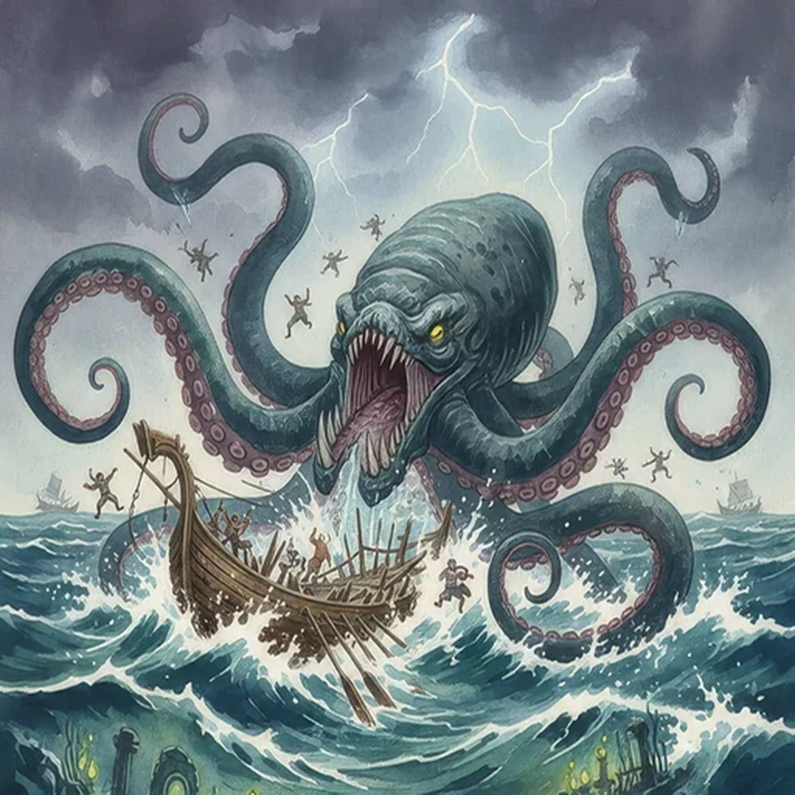

> [!warning] Generated file
> Creature from *Ironsworn: Delve* by Shawn Tomkin, used under CC BY 4.0. The **In YRT** reading is ours, from `extensions/yrt/foes/overrides.json` in the Iron Ledger repository. Edit it there and run `npm run ref` — changes made here are lost.

<figure>  <figcaption>Kraken</figcaption> </figure>

## Features
- Gargantuan size
- Grasping tentacles
- Beaked maw

## Drives
- Lurk in unfathomable depths
- Destroy those who would trespass
- Inflict terror
- Shatter ships

## Tactics
- Grapple and crush
- Attack from every direction
- Sweep sailors from the deck

## Description
The kraken is a sea beast, as large as the mightiest longship. It is octopoid in form, with eight arms, two longer feeding tentacles, and a beak-like mouth. It emerges from the depths to hunt whales, sharks, and other large sea creatures. It is also prone to attack any Ironlander ships which stray into its waters, plucking the crew off the deck and crushing the vessel as easily as one would snap a piece of kindling.

## In YRT

In YRT: a mundane giant cephalopod, just very large. Optional Azure trace for regenerative tissue — it's very hard to kill.
