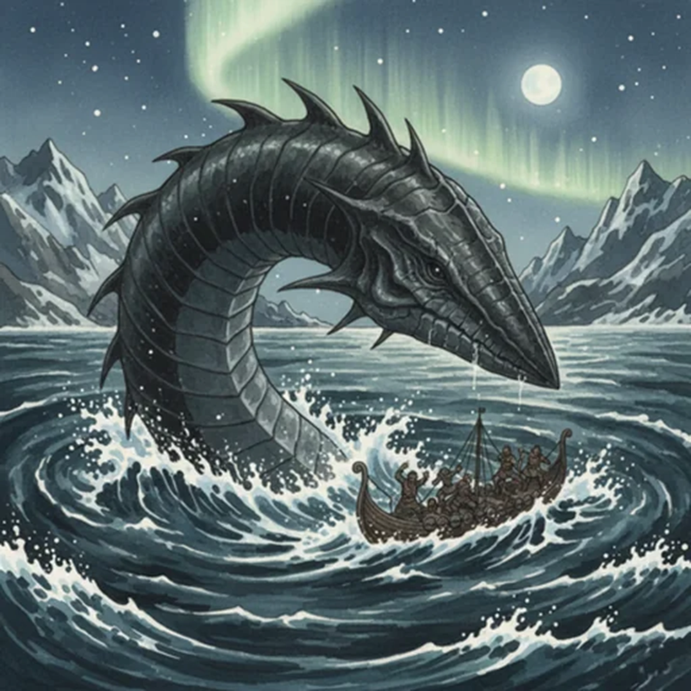

> [!warning] Generated file
> Creature from *Ironsworn* by Shawn Tomkin, used under CC BY 4.0. The **In YRT** reading is ours, from `extensions/yrt/foes/overrides.json` in the Iron Ledger repository. Edit it there and run `npm run ref`. Changes made here are lost.

<figure>  <figcaption>Leviathan</figcaption> </figure>

## Features
- Massive bulk
- Flesh as tough as iron
- Cold black eyes
- Sinuous grace

## Drives
- Slumber in the depths
- Destroy those who trespass

## Tactics
- Rise from the depths
- Ram and swamp ships
- Devour prey whole

## Description
These massive sea beasts lurk in the darkness of the deepest fjords and in the abyssal depths beyond the Barrier Islands. They sometimes surface to hunt within shallower waters. They will indiscriminately destroy any Ironlander craft which stray to close to their hunting grounds.

Watchful sailors might catch sight of a leviathan circling their boat, studying them, in the moments before it attacks. Their dagger-shaped head is as tough and destructive as any battering ram, able to shatter a ship in a single blow.

## In YRT

In YRT: an enormous sea beast, mundane megafauna. Optional deep-ocean blight flavour — Azure-tough tissue and Gray-infused dermis; 'flesh as tough as iron' reads literally.
