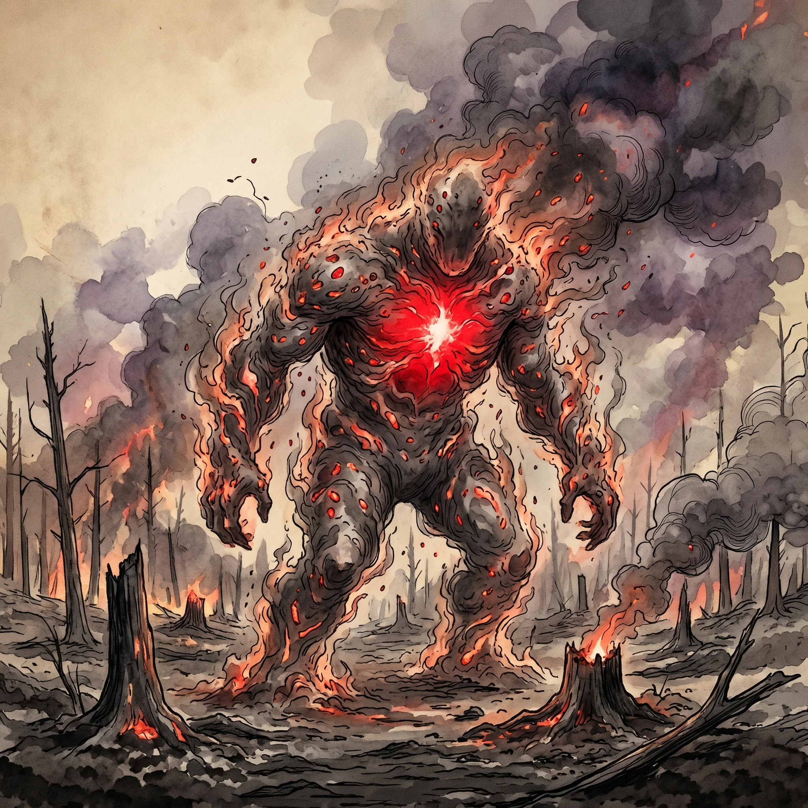
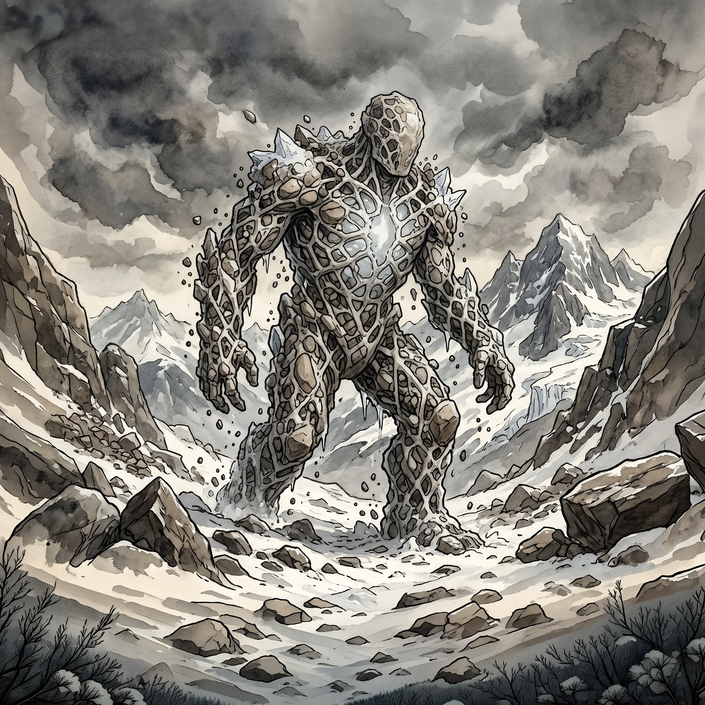
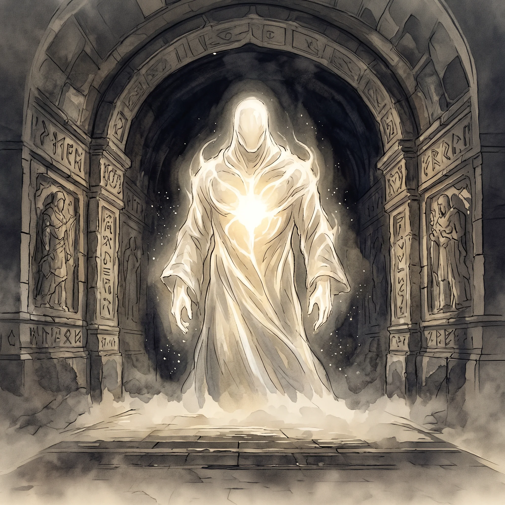
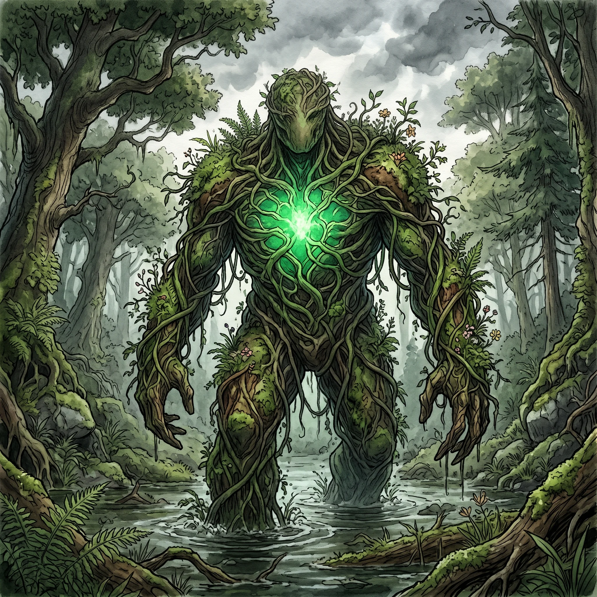

> [!warning] Generated file
> Built from `extensions/yrt/foes/foes.json` in the Iron Ledger repository. Edit it there and run `npm run ref` — changes made here are lost.

<figure>  <figcaption>A Verdant locus — wood, soil, and root mass walking with the gradient of local mana flux, drawn toward higher concentrations without intent.</figcaption> </figure>
<figure>  <figcaption>Locus Crimson</figcaption> </figure>
<figure>  <figcaption>Locus Gray</figcaption> </figure>
<figure>  <figcaption>Locus Luminous</figcaption> </figure>
<figure>  <figcaption>Locus Verdant</figcaption> </figure>

## Features
- A mobile mass of one element — water, stone, fire, vegetation, ice
- Roughly humanoid or large-animal silhouette, but the silhouette shifts
- Single dominant mana colour visible as a glow at its core
- No face, no eyes, no apparent attention
- Variants: Verdant (wood and soil), Crimson (fire and ash), Azure (water and silt), Gray (stone and ice), Luminous (condensed light)

## Drives
- Drift toward areas of high mana flux
- Reorganise its mass when destabilised

## Tactics
- Crush or engulf anything in its drift-path
- Discharge its dominant mana effect outward — flood, fire, stone-shift, growth-burst — when threatened
- Reform when broken apart, slowly, drawing on local matter

## Description
A locus is a wild mana saturation point that has reached enough density to organise itself into a coherent moving body. Each is dominated by one colour, and its body is whatever local matter that colour wants to bind: Verdant (wood, soil, root mass, living plant matter), Crimson (combusting matter, embers, superheated air, ash), Azure (water, often river silt and carried debris), Gray (stone, gravel, ice, soil compacted into a walking lattice), or Luminous (visible light itself, condensed; rare and disturbing).

A locus is not sentient, not agentic, not motivated. It is a self-sustaining mana phenomenon that drifts along the gradient of local mana flux toward higher concentrations. If something happens to be in its path, the locus engulfs it without noticing. If something attacks it, the locus discharges defensively — not in retaliation, but as the mana equivalent of a startle reflex.

The folk belief that loci are vestigial gods is understandable. The truth is the inverse: nature is what's left over after the loci have shaped the regions around themselves over centuries. Loci are very, very hard to destroy. The standard Conclave method is to disperse them by removing the underlying mana saturation — drain the wetland, quench the firebed, clear the contaminated grove.
