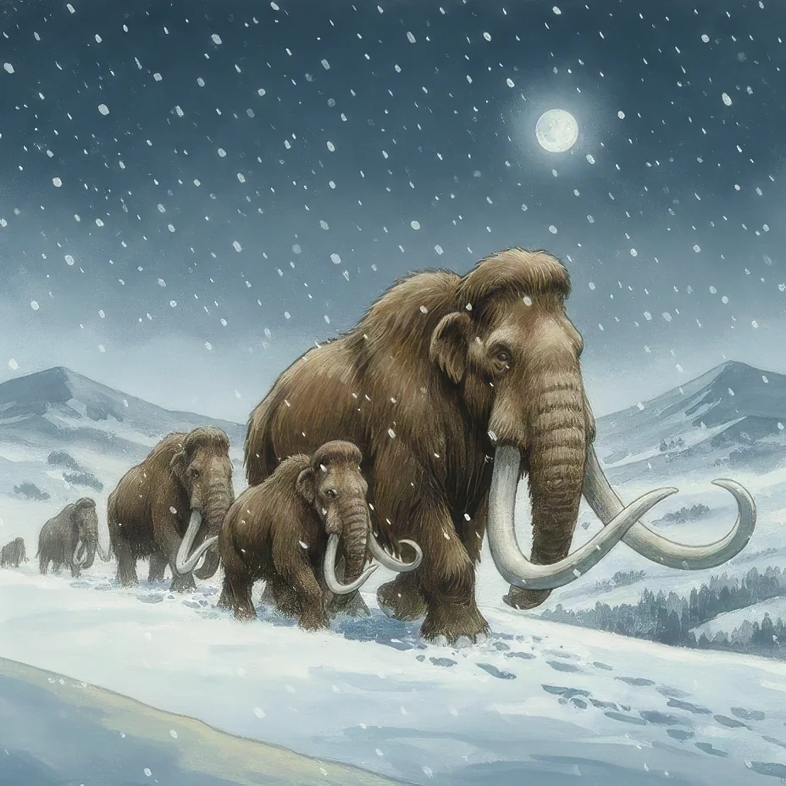

> [!warning] Generated file
> Creature from *Ironsworn* by Shawn Tomkin, used under CC BY 4.0. The **In YRT** reading is ours, from `extensions/yrt/foes/overrides.json` in the Iron Ledger repository. Edit it there and run `npm run ref` — changes made here are lost.

<figure>  <figcaption>Mammoth</figcaption> </figure>

## Features
- Woolly fur
- Large head and curved tusks
- Prehensile trunk

## Drives
- Migrate to fertile ground
- Forage for food
- Protect the young of the herd

## Tactics
- Form a protective circle
- Charge
- Trample
- Gore

## Description
These beasts resemble the elephants of the Old World’s southern realms, but are larger and covered in a coat of thick fur. They travel in herds among the Tempest Hills, migrating south with the winter and north with the spring. They are not aggressive creatures, but are fearless and will fight to the death to protect their young.

A herd of mammoths is an amazing and humbling sight, but smart Ironlanders keep their distance and stay upwind.

## In YRT

In YRT: a mammoth.
