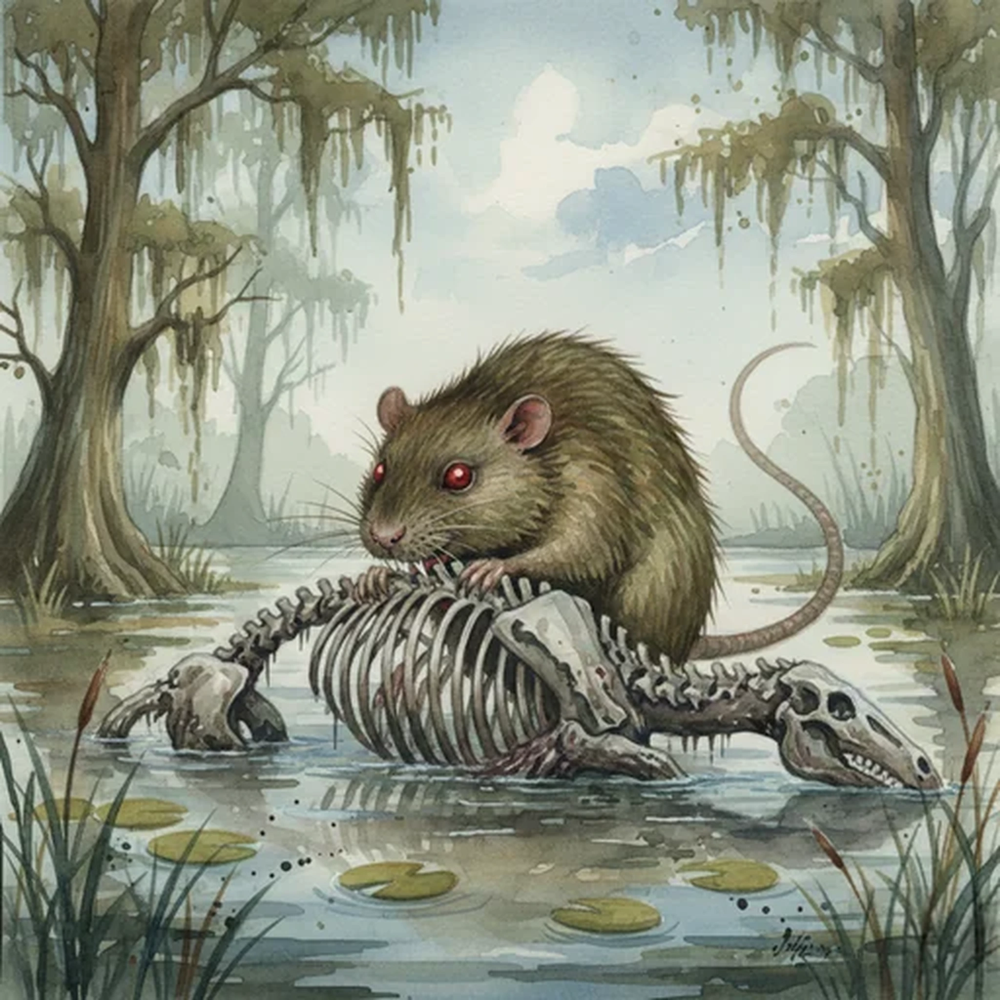

> [!warning] Generated file
> Creature from *Ironsworn* by Shawn Tomkin, used under CC BY 4.0. The **In YRT** reading is ours, from `extensions/yrt/foes/overrides.json` in the Iron Ledger repository. Edit it there and run `npm run ref` — changes made here are lost.

<figure>  <figcaption>Marsh Rat</figcaption> </figure>

## Features
- Beady eyes
- Long tails

## Drives
- Eat everything
- Breed

## Tactics
- Swarm and bite

## Description
The marsh rat is a rodent of unusual size. They are all-too-common in the Flooded Lands or in wetlands within the Hinterlands and Deep Wilds.

They will eat almost anything, including carrion and waste. Our grain stores and pantries are an easy target for a hungry pack, who will dig tunnels or chew through walls to get at the food. They will also try to make a meal out of living prey—deer, cattle, or even an unlucky Ironlander. It is said that a swarm of marsh rats can kill a horse and reduce it to bone in a matter of hours.

## In YRT

In YRT: a large mundane rat.
