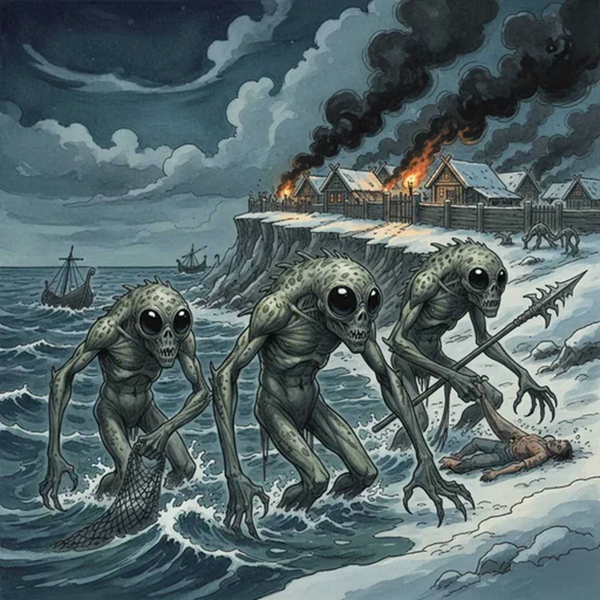

> [!warning] Generated file
> Creature from *Ironsworn: Delve* by Shawn Tomkin, used under CC BY 4.0. The **In YRT** reading is ours, from `extensions/yrt/foes/overrides.json` in the Iron Ledger repository. Edit it there and run `npm run ref`. Changes made here are lost.

<figure>  <figcaption>Merrow</figcaption> </figure>

## Features
- Gray scaled skin
- Bulbous eyes
- Webbed claws

## Drives
- Blood for the deep gods

## Tactics
- Swarm and overwhelm
- Entangle in nets
- Drag back to the depths

## Description
These semiaquatic beings dwell within coastal waters, sea caves, and saltwater marshes. They are fierce protectors of their realm, driven by a zealous devotion to their gods. Their eyes are large and glossy black. They have hunched forms and long limbs, and move with deadly grace in watery environments. Their language is a cacophony of clicks, low grunts, and whistles.

They war against the atanya clans, rarely interact with other firstborn, and are openly hostile to Ironlanders. They emerge from their sunken lairs to swarm over ships or coastal settlements, dragging their victims into the depths. As night falls, the people of seaside villages light their torches, ward their gates, and keep an eye to the waters.

## In YRT

In YRT: an aquatic humanoid species — the religion is human culture, not magic. Crude Azure-based rituals (topical healing, endurance) are consistent with any coastal culture.
