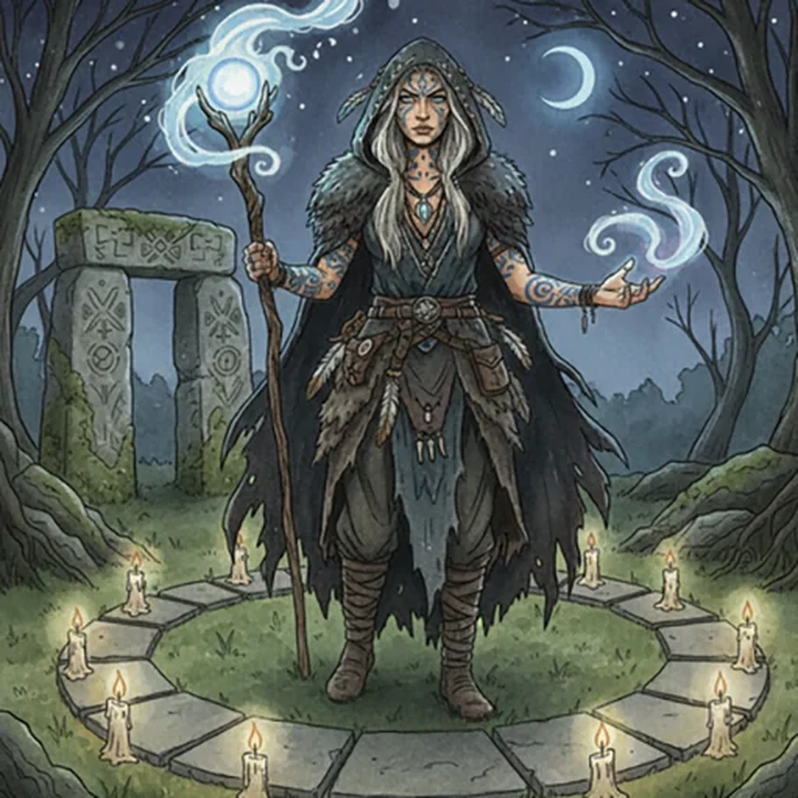

> [!warning] Generated file
> Creature from *Ironsworn* by Shawn Tomkin, used under CC BY 4.0. The **In YRT** reading is ours, from `extensions/yrt/foes/overrides.json` in the Iron Ledger repository. Edit it there and run `npm run ref`. Changes made here are lost.

<figure>  <figcaption>Mystic</figcaption> </figure>

## Features
- Knowing eyes
- Tattooed skin

## Drives
- Respect the old ways
- Seek the paths of power

## Tactics
- Foresee the intent of my enemies
- Prepare rituals
- Use trickery

## Description
Some say you can tell a mystic by looking them in the eye. They walk in two worlds, and their eyes shimmer with that dark reflection of realms beyond our own. We call it the sight. Some hold that darkness in check. Others are consumed by it.

## In YRT

In YRT: a Vizion (Conclave Amber-trained mage) — or an unlicensed one. 'Walks in two worlds' is folk description of a heavy Amber user, and the shimmering eyes are a documented Amber-implant side effect. Amber primary; Luminous + Gray for ward and circle work; some are black-market Black users, which explains 'consumed by the darkness'.
