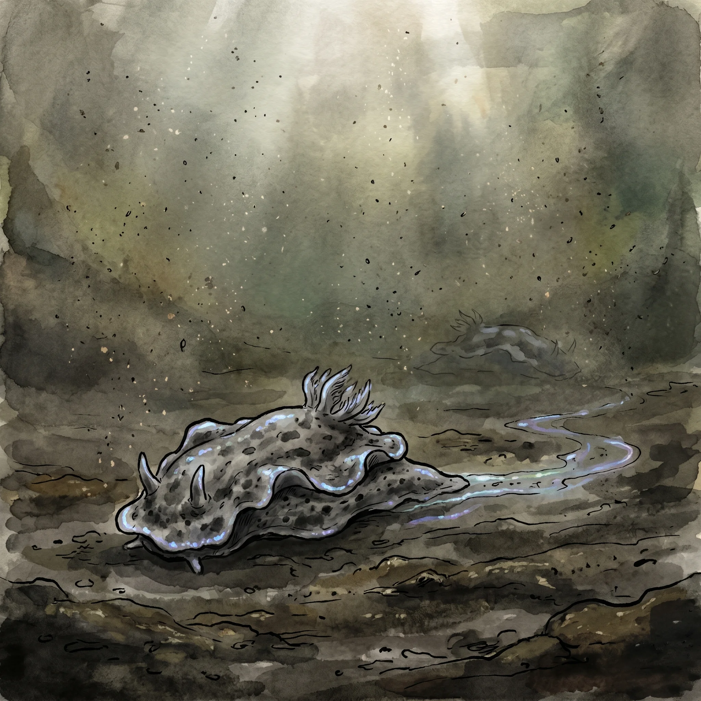

> [!warning] Generated file
> Built from `extensions/yrt/foes/foes.json` in the Iron Ledger repository. Edit it there and run `npm run ref`. Changes made here are lost.

<figure>  <figcaption>A Necrotic Sea Hare — palm-sized, iridescent, and patient, trailing Black-saturated mucus across contaminated sediment.</figcaption> </figure>

## Features
- Palm-sized, soft-bodied, resembling a nudibranch
- Mottled grey-black with faint iridescent blue-purple highlights along the mantle edge
- Moves with unhurried deliberateness along contaminated sediment
- Leaves a thin oily trail of Black-saturated mucus in its wake, faintly luminescent

## Drives
- Process contaminated sediment
- Anchor to warm tissue when disturbed

## Tactics
- Lie motionless in sediment; nearly invisible at rest
- Attach instantly when anything disturbs its substrate — does not chase, latches
- Deliver a sustained dose of Black-contaminated fluid through the attachment point
- Azure saturation in its tissue actively suppresses healing at the contact site
- Does not release voluntarily; must be physically removed or killed while attached

## Description
The Necrotic Sea Hare is a post-Fall bottom-dweller found in contaminated waterways, silted canals, flooded ruins, and any water body close enough to a blight zone for Black mana to have worked into the substrate. It is small enough to hold in your hand and individually not very dangerous. The problem is that it does not stop.

The creature feeds by dissolving organic matter — sediment detritus, waterlogged wood, dead tissue — through a Black-saturated secretion delivered by contact. This is an effective adaptation for processing the contaminated sediment it lives in. Applied to living tissue, the same mechanism causes progressive necrotic breakdown. The longer the attachment continues and the more times the body is forced to Endure Harm, the deeper the contamination spreads and the faster the tissue fails.

A single Necrotic Sea Hare attached to a foot is unpleasant and should be dealt with promptly. Several of them in a silted crossing you did not see until you were waist-deep in the water is a serious emergency.

Removal requires getting clear of the water and treating the attachment site directly. Cold water slows but does not stop the process. Cutting the creature off while attached without treating the wound leaves contaminated mucus in the wound, which must be treated separately. Conclave records categorise the Necrotic Sea Hare as a contamination indicator rather than an active threat, which is technically accurate and practically unhelpful.
