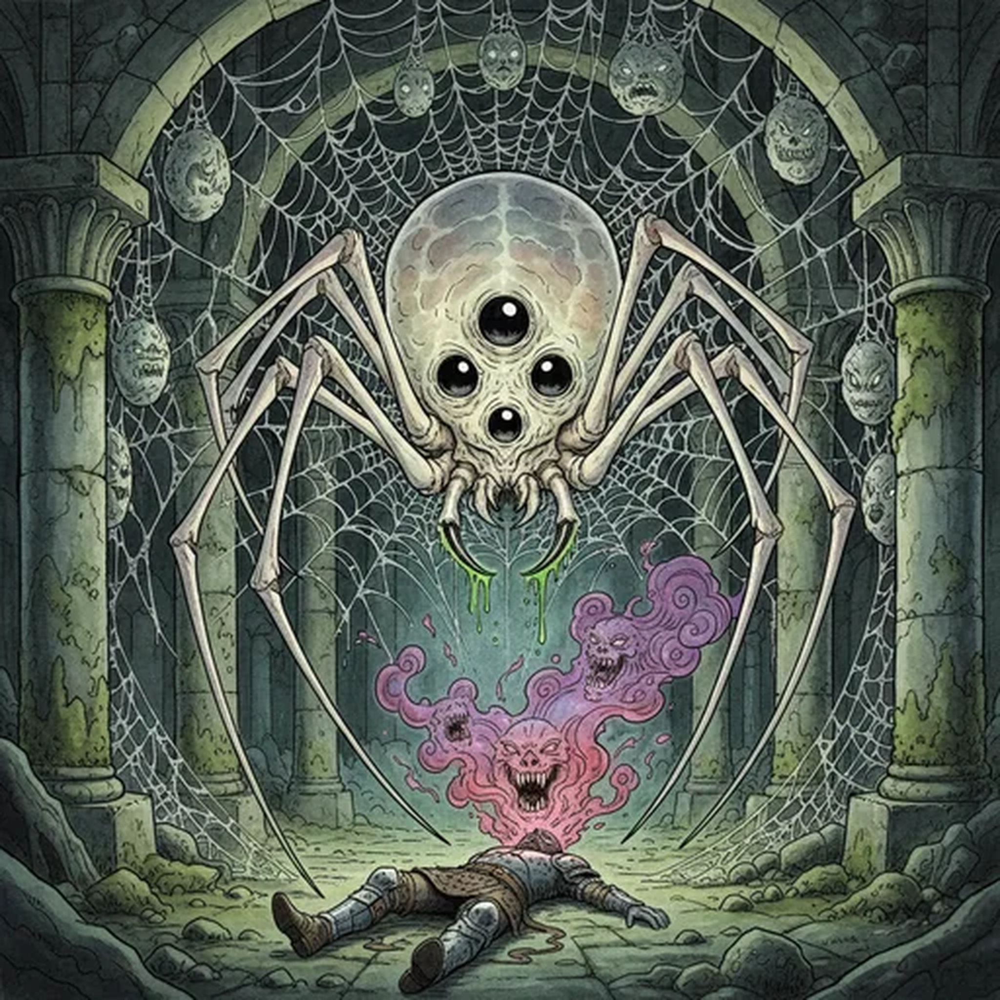

> [!warning] Generated file
> Creature from *Ironsworn: Delve* by Shawn Tomkin, used under CC BY 4.0. The **In YRT** reading is ours, from `extensions/yrt/foes/overrides.json` in the Iron Ledger repository. Edit it there and run `npm run ref`. Changes made here are lost.

<figure>  <figcaption>Nightmare Spider</figcaption> </figure>

## Features
- Pale, semitransparent body
- Long, skinny legs
- Fangs, dripping with venom

## Drives
- Lurk in darkness
- Feed
- Lay eggs

## Tactics
- Spin webs
- Drop on prey
- Pierce with venomous fangs

## Description
Nightmare spiders are monstrous creatures which dwell in caves, ruins, thick woods, and other dark places. They have narrow, translucent bodies, three pairs of black eyes, and long, slender legs. They typically feed on bats and rodents, but are opportunistic hunters and attack anything straying into their path or stumbling into their webbing. Their lairs are often strung with large silk egg sacs.

For smaller animals, the toxic bite of the nightmare spider causes paralysis. For a typical Ironlander, it dulls the senses and induces vivid hallucinations. It is these frightening, dreamlike visions which earn the creature its name.

## In YRT

In YRT: a giant spider. The hallucinogenic venom is biochemistry, not magic. Optional Amber trace in the venom glands — the vivid hallucinations are biochemically indistinguishable from a weak Amber dose.
