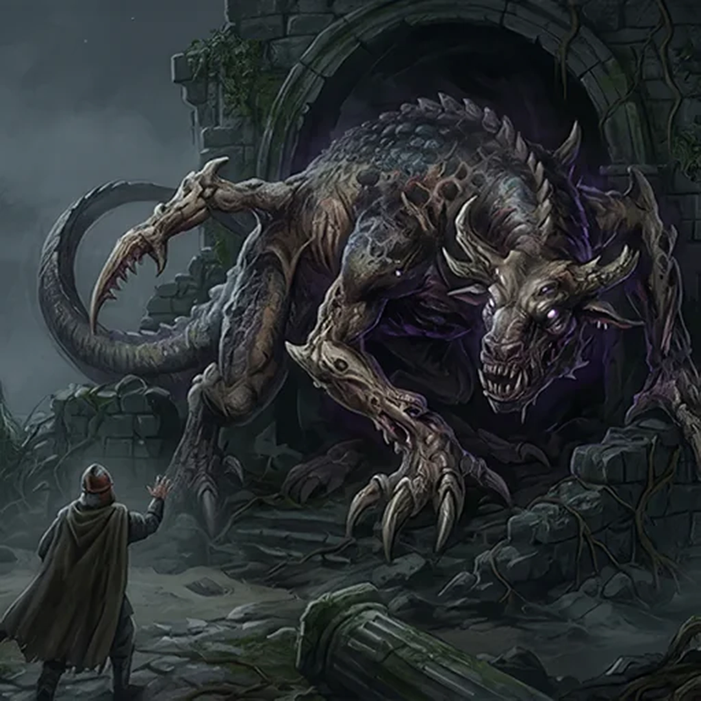

> [!warning] Generated file
> Creature from *Ironsworn: Delve* by Shawn Tomkin, used under CC BY 4.0. The **In YRT** reading is ours, from `extensions/yrt/foes/overrides.json` in the Iron Ledger repository. Edit it there and run `npm run ref`. Changes made here are lost.

<figure>  <figcaption>Nightspawn</figcaption> </figure>

## Features
- Mutated <a class="oracle-link" data-oracle="monstrosityPrimaryForm">form</a>, <a class="oracle-link" data-oracle="monstrositySize">size</a>, <a class="oracle-link" data-oracle="monstrosityCharacteristics">characteristics</a>

## Drives
- Guard against intruders
- Lurk in the shadows
- Endure beyond memory

## Tactics
- Varied <a class="oracle-link" data-oracle="monstrosityAbilities">ability</a>

## Description
What we call the nightspawn are mutated beasts which take a variety of forms. Some are animal-like, or combine the characteristics of different creatures. Others are bizarre aberrations seemingly born of chaos. A few even possess twisted mockeries of human features.

They are rare beasts, but dwell in every region and environment of the Ironlands, from the dark waters of the Ragged Coast to the icy plains of the Shattered Wastes. Often, they protect ancient ruins, forgotten relics, and other secrets. They watch and wait, and show no mercy to those who trespass in their domain.

We do not know the origin of the nightspawn. They are enigmatic creatures, rarely emerging from their dark lairs except during the long nights of winter. Is it the latent magic of these lands which gives them life? Have they passed through the veil from some other realm? Perhaps some questions are best left unanswered.

## In YRT

In YRT: the definition-perfect blight creature — gestated in or near a contaminated zone. Colour and capability vary by zone: a Black-zone nightspawn leeches life, a Crimson-zone one discharges energy, a mixed-zone one is unpredictable. Roll on a blight-contamination table per individual.
