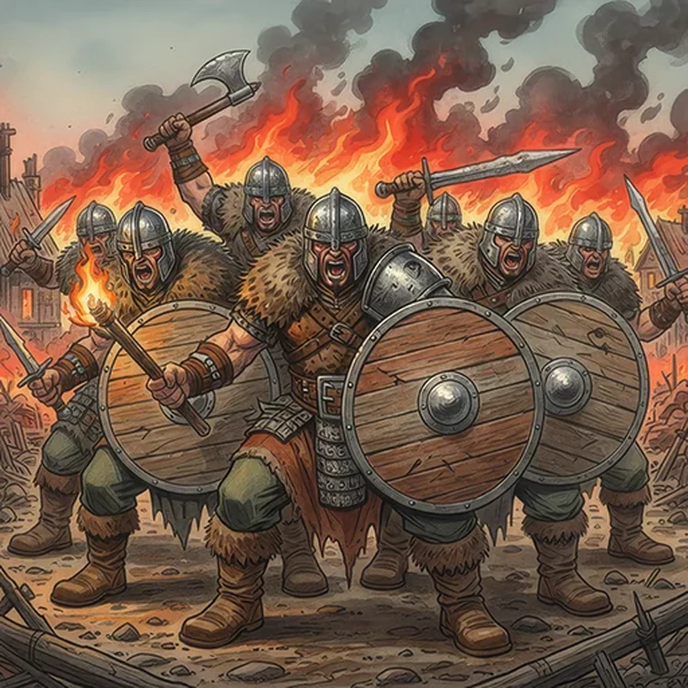

> [!warning] Generated file
> Creature from *Ironsworn* by Shawn Tomkin, used under CC BY 4.0. The **In YRT** reading is ours, from `extensions/yrt/foes/overrides.json` in the Iron Ledger repository. Edit it there and run `npm run ref`. Changes made here are lost.

<figure>  <figcaption>Raider</figcaption> </figure>

## Features
- Geared for war
- Battle fervor

## Drives
- What is theirs will be ours
- Stand with my kin
- Die a glorious death

## Tactics
- Intimidate
- Shield wall
- Burn it down

## Description
Raiders survive by seizing what they need from others. Our grain. Our meat. Our animals. Our iron. They’ll take it all, and leave us facing the long winter with nothing to sustain us but prayers to indifferent gods.

## In YRT

In YRT: humans with axes.
