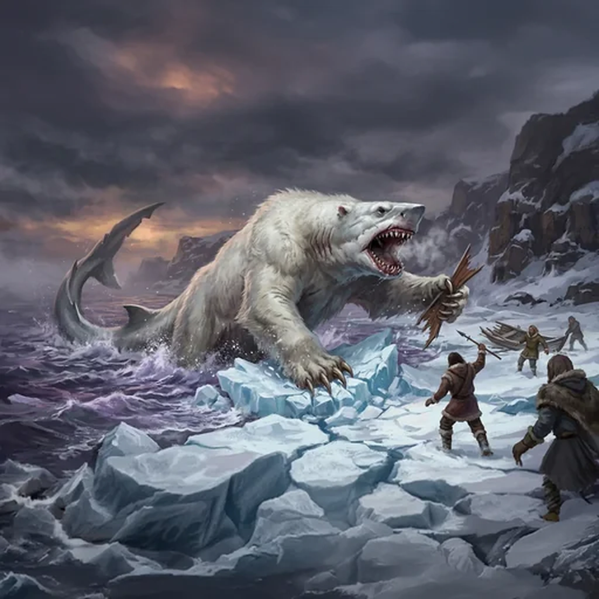

> [!warning] Generated file
> Creature from *Ironsworn: Delve* by Shawn Tomkin, used under CC BY 4.0. The **In YRT** reading is ours, from `extensions/yrt/foes/overrides.json` in the Iron Ledger repository. Edit it there and run `npm run ref` — changes made here are lost.

<figure>  <figcaption>Rhaskar</figcaption> </figure>

## Features
- White fur
- Shark-like head
- Rows of razor-sharp teeth
- Massive claws

## Drives
- Protect territory
- Hunt prey in water and on land

## Tactics
- Burst through ice
- Rend with savage claws
- Clamp down with a powerful bite
- Shake victims like a hound with a rat

## Description
In the language of the atanya, rhaskar means “white death.” This mighty beast dwells within northern waters and amid frozen icereaches. It hunts along shorelines, lurks beneath ice, or tracks the frigid wastes in search of prey. Some rhaskar have even been known to attack ships in coastal waters. It is a highly territorial creature, and does not abide trespassers within its domain.

With its mane of dorsal fur and long, angular head, the rhaskar looks like a fusion of shark and bear—and embodies the strength and cunning of both. It is the uncaring ferocity of these cold northern realms given form.

## In YRT

In YRT: a mundane large arctic predator — a big territorial animal.
