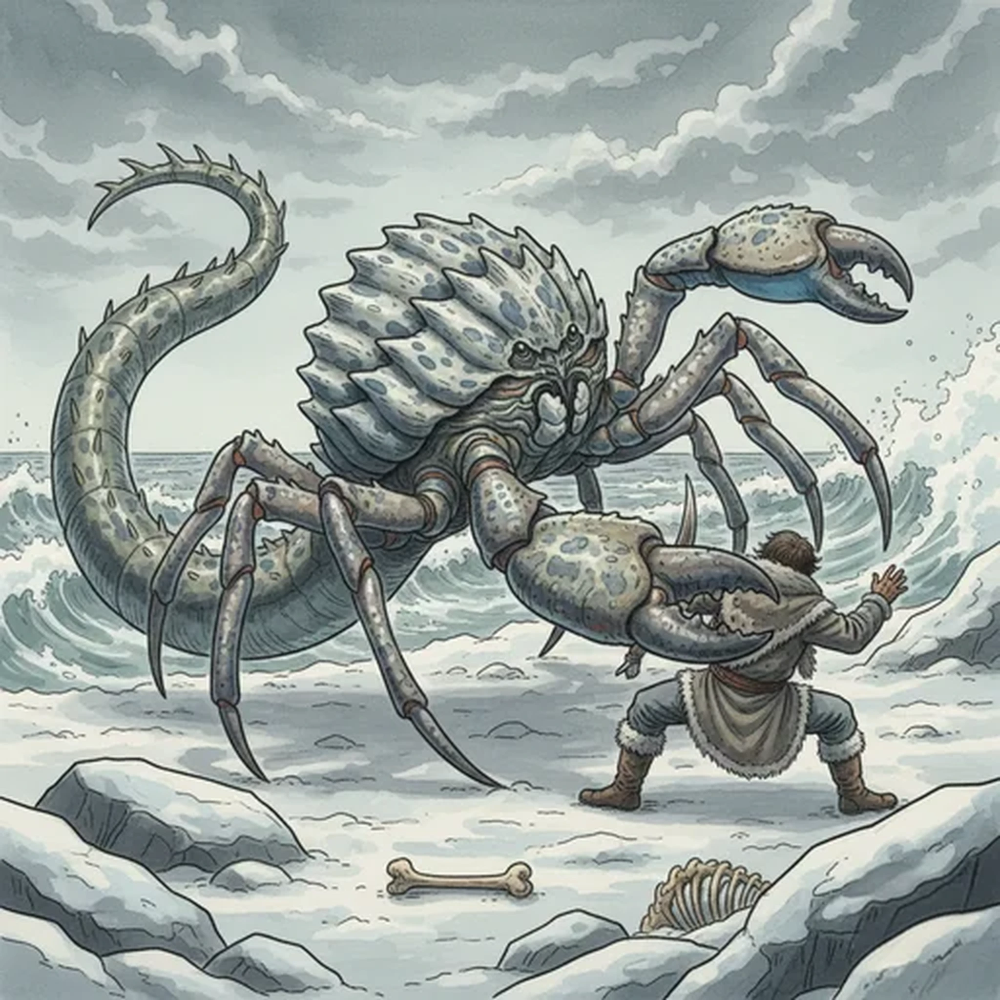

> [!warning] Generated file
> Creature from *Ironsworn: Delve* by Shawn Tomkin, used under CC BY 4.0. The **In YRT** reading is ours, from `extensions/yrt/foes/overrides.json` in the Iron Ledger repository. Edit it there and run `npm run ref` — changes made here are lost.

<figure>  <figcaption>Shroud Crab</figcaption> </figure>

## Features
- Ridged shell
- Snapping, slashing claws
- Barbed, whiplike tail

## Drives
- Lie hidden among rocks and ice
- Feed

## Tactics
- Mimic surroundings
- Leap at unsuspecting prey
- Latch onto victims with powerful legs and tail
- Stab and slash

## Description
Shroud crabs threaten careless or unlucky Ironlanders along coasts and icereaches. They have long legs, a segmented tail, and large, serrated claws.

Their carapace changes color to perfectly match their environment, making them nearly invisible among rocks or ice. When potential prey strays near, a shroud crab uses its powerful legs to spring at its victim. Then, it wraps around them in a horrible embrace, stabbing and slashing with its claws and barbed tail.

Packs of shroud crabs are known to work in tandem to bring down large prey. Some report seeing mighty elk engulfed by these voracious creatures. On occasion, the body of a missing Ironlander is found with their flesh picked clean to the bones.

## In YRT

In YRT: a camouflaging crustacean. Optional trace Gray in the carapace for matter-matching camouflage; otherwise mundane chromatophores.
