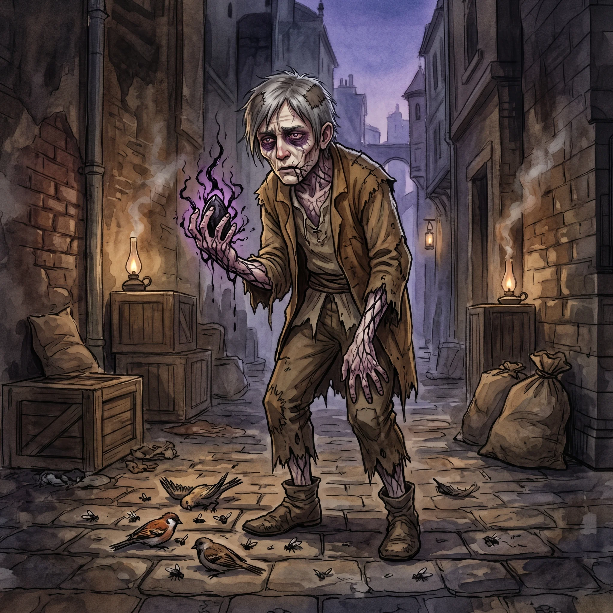

> [!warning] Generated file
> Built from `extensions/yrt/foes/foes.json` in the Iron Ledger repository. Edit it there and run `npm run ref` — changes made here are lost.

<figure>  <figcaption>The Tainted — Black corruption veining the skin of a habitual user of Spero-tainted seeds, prematurely aged and trailed by the small dead things that accumulate in their wake.</figcaption> </figure>

## Features
- Visible Black corruption tracing like veins through the skin, darkest near the hands and mouth
- Premature aging: grey hair, sunken cheeks, paper-thin skin on someone who should be young
- A faint smell of ozone and rotten meat around the body
- Small dead things — flies, mice, birds — tend to accumulate near where they have been

## Drives
- Keep using; nothing else has ever felt like this
- Protect the supply

## Tactics
- Use Black-tainted seeds recklessly, accepting backlash as the cost of power
- Lash out with Black-infused Crimson blasts when cornered
- Call up reflexive animation of nearby dead matter — mice, birds, small carrion — as distraction
- Die badly when defeated, and animate local dead matter more strongly as they go

## Description
The Spero refinement operation has been producing Black-tainted mana for over a year. The Brotherhood and Ecclesia refiners know this and have tried to compensate, but their crude process cannot fully strip out the Black from an unrefined manite batch. The tainted seeds enter Freeport's underworld at discount prices and are bought by people who cannot afford Conclave rates — illegal seed-crafters, hedge-mages, desperate amateurs, and a growing number of young Conclave apprentices who are quietly skimming from their allotments.

A user who casts with tainted seeds once or twice usually gets away with nothing worse than a bad headache. Sustained use is different. Black mana binds preferentially to living tissue, accumulates in the nervous system, and does not metabolise out. Over months of regular use, the user becomes tainted — physically altered by cumulative Black saturation, cognitively altered by the slow erosion of impulse control that Black causes, and addicted in a way that no ordinary substance produces.

A tainted person is still themselves, mostly. They remember who they are, they can hold a conversation, they pay their debts. But they have crossed a threshold, and they know it, and they cannot stop. A small number of Azure treatment programs exist at Conclave hospices, but they are expensive, long-duration, and have roughly a one-in-three success rate.
