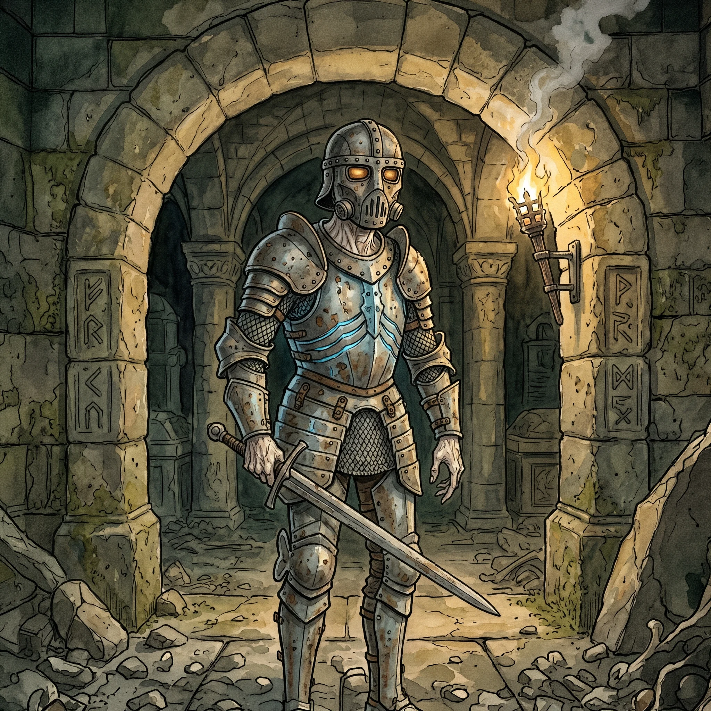

> [!warning] Generated file
> Built from `extensions/yrt/foes/foes.json` in the Iron Ledger repository. Edit it there and run `npm run ref`. Changes made here are lost.

<figure>  <figcaption>A tomb walker — a living person inside a Gray-and-Azure life-support rig, iron-masked and lens-eyed, honouring an oath at a cost no sane person would pay.</figcaption> </figure>

## Features
- Pallid, papery skin stretched over visible bone structure
- Iron mask with breathing-vents and lens slots
- A faint humming beneath the armour — the preservation rig at work
- Outer plating that visibly resets its alignment after each impact — the Gray lattice redistributing
- Slow, deliberate movement; limbs creak when they bend

## Drives
- Fulfil the charge taken on at the time of installation
- Preserve the integrity of the rig

## Tactics
- Absorb the opening assault behind the hardened Gray lattice — the rig redistributes automatically
- Methodical, relentless assault once inside engagement distance
- Use whatever weapons and knowledge the host had in life — none of which have decayed

## Description
A tomb walker is a living person encased in a partial life-support rig designed to extend function indefinitely past the natural end of their body. The setup is Conclave-illegal and brutal: a Gray-and-Azure lattice fitted around the torso replacing failing organ function with mana-driven equivalents, with a reservoir at the small of the back running the whole system. Azure handles tissue maintenance. Gray provides structural support where the skeleton has begun to fail.

The host is alive. They breathe (the rig assists), their heart beats (mechanically, where necessary), and they retain the memory, reasoning, and charge they accepted at installation. They have not died and come back. They have refused to die at considerable cost, and they know to the day exactly how much time they have left.

The Gray lattice does more than hold the body together. Under impact stress it automatically redirects from structural support to a compressed outer field — a hardened shell that takes the brunt of each blow before it reaches the host. Each time the tomb walker survives, the remaining lattice compresses and redistributes. When the reserve finally runs dry and the field collapses, the host is fully exposed.
