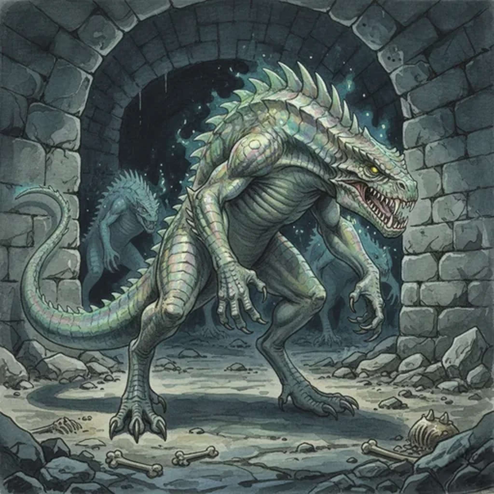

> [!warning] Generated file
> Creature from *Ironsworn: Delve* by Shawn Tomkin, used under CC BY 4.0. The **In YRT** reading is ours, from `extensions/yrt/foes/overrides.json` in the Iron Ledger repository. Edit it there and run `npm run ref` — changes made here are lost.

<figure>  <figcaption>Trog</figcaption> </figure>

## Features
- Luminescent, scaled hide
- Keen vision
- Long claws and sharp teeth
- Powerful tail

## Drives
- Lurk in darkness
- Dig tunnels

## Tactics
- Stealthy approach
- Intimidating display
- Pounce
- Bite and thrash

## Description
Trogs are warm-blooded reptilian animals. They dwell in the deepest places of the Ironlands, but have moved closer to the surface in recent years. Some suggest a greater threat in those dark domains is driving them toward the surface. Many a barrow or underkeep has been breached by trogs who tunnel into those spaces.

They are strong and agile, able to run, climb, and swim with equal speed. When they stand on two legs as a display of aggression, they are nearly as tall as an Ironlander. They have a hunched back lined with a ridge of spines, a long snout, and serrated teeth. Their scales glimmer with a colorful, ghostly light. Their bite is as powerful and unyielding as a hammer blow.

## In YRT

In YRT: a burrowing reptilian predator. Luminous trace gives the bioluminescent scale layer; faint Verdant explains longevity and regrowth of claws and scales. Green-white glow.
