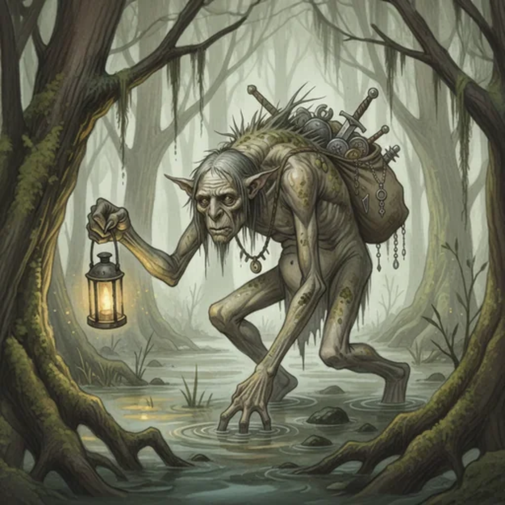

> [!warning] Generated file
> Creature from *Ironsworn* by Shawn Tomkin, used under CC BY 4.0. The **In YRT** reading is ours, from `extensions/yrt/foes/overrides.json` in the Iron Ledger repository. Edit it there and run `npm run ref` — changes made here are lost.

<figure>  <figcaption>Troll</figcaption> </figure>

## Features
- Long limbs
- Sunken, beady eyes
- Translucent skin camouflaged to the environment
- Keen sense of smell
- Speaks in gibberish

## Drives
- Find pretty things
- Keep it secret

## Tactics
- Be sneaky
- Bite and claw
- Run and hide

## Description
Trolls mostly live in the Flooded Land, but it’s not unusual to encounter one in the Hinterlands or even in the southern reaches of the Havens. They are solitary creatures, wary of contact with Ironlanders but likely to attack if scared or provoked.

They move with their back hunched, often skulking on all four gangly limbs. When they stand straight they are much taller than humans—nearly as tall as a giant. Their skin is a sickly pale gray, but they can camouflage themselves by changing it to match their environment.

Trolls collect objects of all sorts, and particularly value Ironlander trinkets. They are tormented by the fear of others stealing their hoard, and are constantly seeking out new, better hiding places. The items are mostly junk to anyone but a troll, but occasionally an object of real value finds its way into the dregs.

## In YRT

In YRT: a large humanoid with camouflaging skin — the same chromatophore trick as a shroud crab, just bigger. Gray-trace dermal layer; otherwise mundane biology. Solitary, shy, hoards objects.
