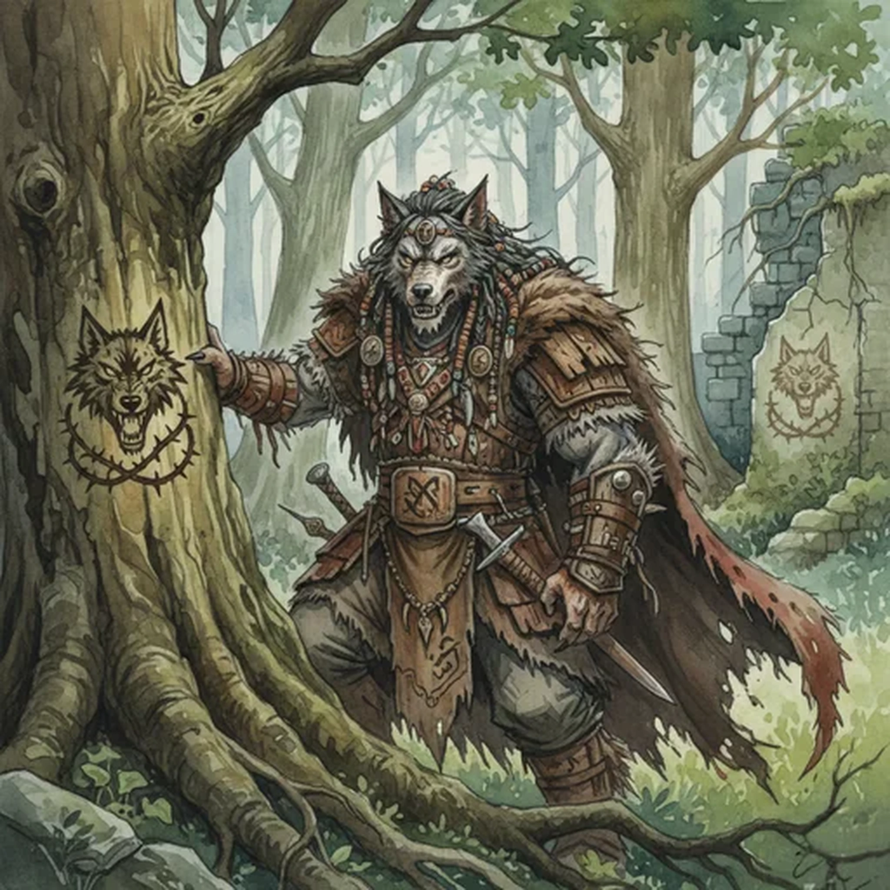

> [!warning] Generated file
> Creature from *Ironsworn* by Shawn Tomkin, used under CC BY 4.0. The **In YRT** reading is ours, from `extensions/yrt/foes/overrides.json` in the Iron Ledger repository. Edit it there and run `npm run ref`. Changes made here are lost.

<figure>  <figcaption>Varou</figcaption> </figure>

## Features
- Yellow eyes shining in the moonlight
- Pointed ears and snout-like faces

## Drives
- Take their land
- Defend my kin
- Keep the bloodcall at bay

## Tactics
- Strike at night
- Leap into combat
- Let loose the bloodcall

## Description
The varou are humanoid beings who dwell within the Deep Wilds and in the woods of the Hinterlands. They have fierce, wolf-like features and are broad-shouldered and a head taller than the average Ironlander. Their long hair is ornately groomed and decorated with beads and other trinkets.

The varou value territory above all things. They often war amongst themselves and against the elves to gain or defend holdings. They mark their claims by carving clan symbols into trees. Only the foolish ignore the warning of these border signs. Several of our settlements—built too close to varou territory—are now abandoned ruins bearing the mark of a victorious varou clan.

## In YRT

In YRT: a wolf-featured humanoid species. The 'bloodcall' reads as Crimson susceptibility — their nervous system reacts to local Crimson mana and blood scent with a rage state. They avoid blight zones for this reason.
