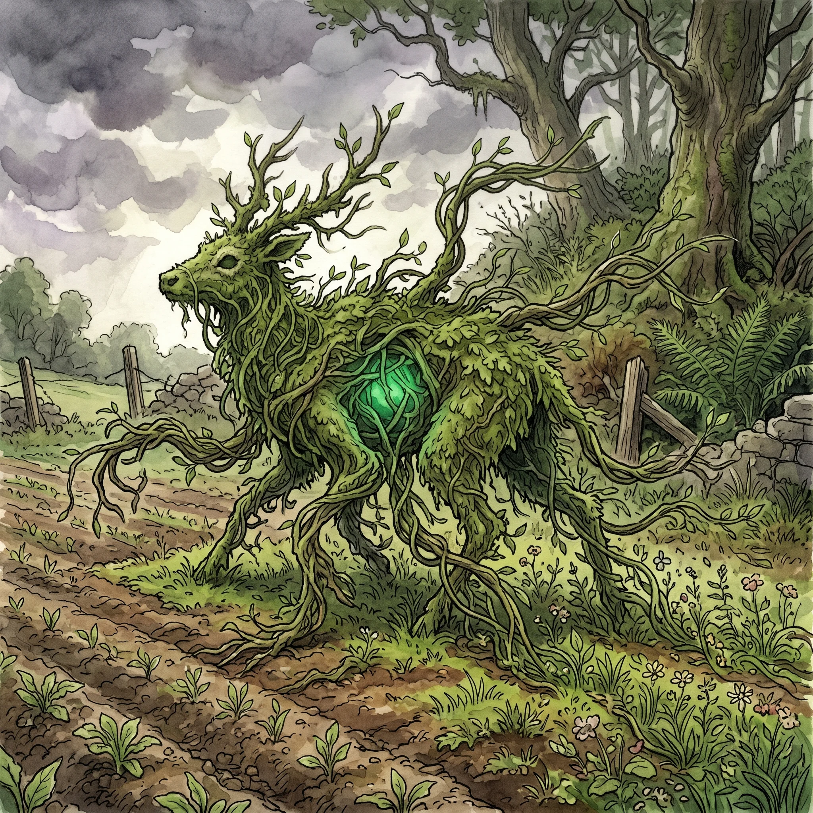

> [!warning] Generated file
> Built from `extensions/yrt/foes/foes.json` in the Iron Ledger repository. Edit it there and run `npm run ref` — changes made here are lost.

<figure>  <figcaption>A verdant crawler — a forest mammal overgrown with vine and root until the original animal became a chassis for the plant matter that now rides it.</figcaption> </figure>

## Features
- A four-to-six-legged body, originally some forest mammal, now encased in living vine and root
- Multiple grasping limbs of tangled growth that extend beyond the original anatomy
- A visible Verdant pulse at the body's core, slow and steady
- Leaves a trail of fast-growing weeds wherever it walks

## Drives
- Spread Verdant saturation into surrounding land
- Defend the overgrown territory it inhabits

## Tactics
- Entangle with fast-growing tendrils that root the target in place
- Accelerate plant growth in the immediate area to block escape routes
- Heal minor injuries by drawing Verdant from local soil

## Description
When uncontrolled Verdant mana saturates a region, the boundary between fauna and flora begins to soften. A verdant crawler is what's left of a deer, a boar, or a large dog that wandered into a Verdant blight zone and didn't leave. The mana didn't kill it; it integrated with it. Vines and root-mass grew through the animal's body, replacing soft tissue with green tissue, until the original creature was less an organism and more a chassis for the plant matter that now rides it.

A crawler is still alive in some sense — it eats (sunlight and soil), it moves (on its modified original limbs), it defends territory (instinctively). But it is no longer the animal it used to be, and it is not really a plant either. It is the manifestation of Verdant excess in an area where Verdant excess has nowhere else to go.

Crawlers are drawn to cultivated land. The reason is mechanical: cultivated land is rich in worked soil and growth-ready conditions, which the crawler's Verdant lattice reads as ideal substrate. A crawler on the edge of a farm is not raiding. It is attempting to integrate the farm into its territory.
