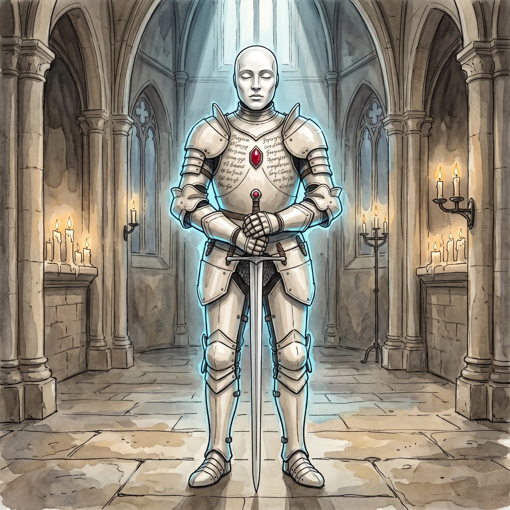

> [!warning] Generated file
> Built from `extensions/yrt/foes/foes.json` in the Iron Ledger repository. Edit it there and run `npm run ref`. Changes made here are lost.

<figure>  <figcaption>A vow walker: a Luminous-shelled reliquary construct with Azure-lit joints and a Crimson vow-heart, bearing the ceramic death-mask of the oath-giver.</figcaption> </figure>

## Features
- Pale Luminous-coated armour shell, etched with prayers
- Joints glow faint blue when moving — Azure flexion
- A red gem visible at the chest where the Crimson power core is housed: the vow heart
- A white ceramic death-mask cast from the face of the deceased
- Walks correctly — eerily upright, eerily steady. That is the tell.

## Drives
- Honour the standing oath of the deceased it commemorates
- Defend the designated principal until the oath is discharged

## Tactics
- Steady, inexorable advance
- Attack with iron weapons; deflect with the Luminous shell
- Ignore wounds that would stop a living defender
- Pursue without rest until the oath is discharged or the walker is destroyed

## Description
The Pura Ecclesia is, in ordinary doctrine, opposed to the use of dead matter and to the animation of the inert. The vow walker is the order's one acknowledged exception — a doctrinal compromise so politically delicate that it is held by a single internal suborder, the Iron Wardens, and is never discussed with outsiders.

A vow walker is built to honour a final oath. When a senior Ecclesia figure faces death they may, with the order's approval, dictate a final standing oath. The oath is recorded. The body is interred. A vow walker is then constructed as the oath's reliquary: a Luminous-shelled, Azure-jointed, Crimson-cored armour body, carrying the deceased's death-mask and a single Amber tablet inscribed with the oath.

The Iron Wardens hold the operating Amber keys. Each vow walker has a designated handler from within the Wardens, and that handler is responsible for the construct's actions for the rest of their life. The Ecclesia's theological line is precise: they do not animate the dead; the construct is a reliquary, not a corpse. A vow walker can be destroyed. The shell is tough but not invulnerable; the Crimson core, once breached, ends the construct cleanly.
